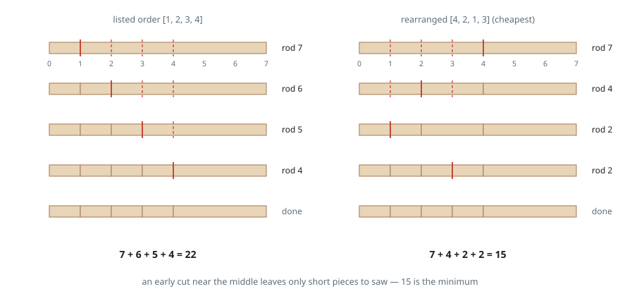

# Cheapest Order to Cut a Rod

## Description

A rod `n` units long lies marked at every integer position from `0` to `n`.
You are given an integer array `cuts` listing the positions where the rod must
be sawn through; the sawing order is yours to choose.

Each pass of the saw cuts one piece in two and costs as much as that piece is
long. The two new pieces have lengths summing to the piece that was cut.

Return the smallest total cost at which every position in `cuts` gets cut.

### Example 1

```text
Input: n = 7, cuts = [1,2,3,4]
Output: 15
Explanation: Sawing left to right as listed pays 7 + 6 + 5 + 4 = 22, because
every pass still has to cross what remains of a long rod. The order 4, 2, 1, 3
instead pays 7 + 4 + 2 + 2 = 15: the first pass at 4 breaks the rod into a
short and a medium piece, and every later pass crosses only short pieces.
```



### Example 2

```text
Input: n = 9, cuts = [8,3,5,1,6]
Output: 24
Explanation: The listed order pays 28. The order 3, 1, 6, 5, 8 pays
9 + 3 + 6 + 3 + 3 = 24, which is the least achievable.
```

### Example 3

```text
Input: n = 10, cuts = [3,6]
Output: 16
Explanation: Cutting at 3 before 6 pays 10 + 7 = 17. Reversing them pays
10 + 6 = 16: whichever cut falls inside the shorter side piece should wait.
```

### Constraints

- `2 <= n <= 10⁶`
- `1 <= cuts.length <= min(n - 1, 100)`
- `1 <= cuts[i] <= n - 1`
- All elements of `cuts` are distinct.

## Hints

### Hint 1

Whatever order you use, the first saw pass inside any stretch of rod splits
that stretch in two, and the two sides never interact again. Each side is a
smaller instance of the same question.

### Hint 2

Sort the cut positions together with the two rod ends, and let `dp[i][j]` be
the cheapest way to perform every cut lying between boundary `i` and boundary
`j`. The first cut inside that stretch is one of the boundaries between them,
and it is charged the stretch's full length:
`dp[i][j] = min(dp[i][k] + dp[k][j]) + (j - i)` over every `k` between.
