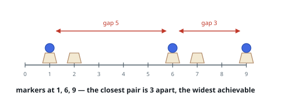

# Maximize the Smallest Gap

## Description

You are given an integer array `slots`, listing the coordinates of `n` slots
arranged along a line, and an integer `m`. Pick `m` of the slots and drop one
marker into each.

Two markers at coordinates `x` and `y` sit `|x - y|` apart. Place your markers
so that the closest pair is as far apart as possible, and return the distance
that closest pair then has.

### Example 1

```text
Input: slots = [1,2,6,7,9], m = 3
Output: 3
Explanation: Markers at 1, 6, and 9 are 5, 3, and 8 apart, so the closest
pair is 3 apart. No choice of three slots keeps every pair 4 or more apart.
```



### Example 2

```text
Input: slots = [900000000,42,7,600000000], m = 2
Output: 899999993
Explanation: The coordinates come unsorted. With only two markers, the
extremes are best: 7 and 900000000.
```

### Example 3

```text
Input: slots = [4,5,6,7], m = 4
Output: 1
Explanation: Every slot must hold a marker, and adjacent slots sit exactly
1 apart.
```

### Constraints

- `n == slots.length`
- `2 <= n <= 10⁵`
- `1 <= slots[i] <= 10⁹`
- All values in `slots` are distinct.
- `2 <= m <= slots.length`

## Hints

### Hint 1

If the markers can be arranged with every pair at least `d` apart, the same
arrangement works for any smaller `d` as well. So over candidate values of
`d`, the answerable instances form a prefix — and the task is to find where
that prefix ends.

### Hint 2

To test a single `d`, sort the coordinates and sweep left to right, putting a
marker in the first slot, then in the next slot at least `d` beyond the last
marker, and so on. Taking the earliest legal slot each time never hurts.

### Hint 3

With that test in hand, binary search `d` between 1 and the full span.
