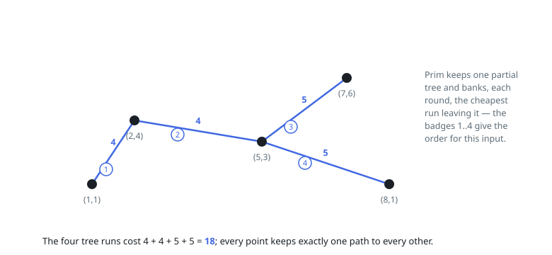

# Solutions — Least Wiring to Connect All Points

## Prim's minimum spanning tree

Wiring every point for the least total length is the minimum spanning tree
problem on the complete graph whose edge weights are Manhattan distances.
With as many as 1000 points that graph is dense, and an adjacency-free
`O(n²)` Prim is the right shape: even writing out the edge list would already
cost `O(n²)`, so a heap buys nothing here.

The tree is grown from point 0. Two arrays carry the state: `best[v]`, the
shortest Manhattan distance from the growing tree to the outside point `v`,
and a `used` flag per point. Each of the `n` rounds scans for the unused
point `u` with smallest `best`, banks `best[u]`, marks `u` used, and then
re-relaxes every remaining outside point against `u`. The scan and the
relaxation are both `O(n)` per round.

Why the greed is safe is Prim's cut property: of all runs leaving the current
tree, the cheapest one can always belong to some optimal wiring, so `n`
rounds accumulate exactly the MST weight. The guard `n <= 1` returns 0 at
once, and `best[0] = 0` seeds the first pick for free so the start point
contributes no length of its own.

**Complexity:** `O(n²)` time, `O(n)` space.
