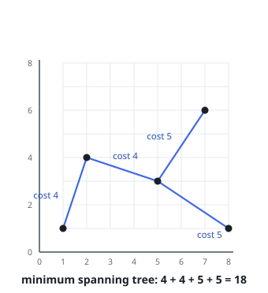

# Least Wiring to Connect All Points

## Description

An array `points` holds integer coordinates scattered across the plane, one
pair per entry: `points[i] = [xi, yi]`.

Wire may be run between any two points, and the run from `[xi, yi]` to
`[xj, yj]` measures `|xi - xj| + |yi - yj|` — the Manhattan distance between
its two ends.

Wiring is finished once a path of wire leads from every point to every other.
Return the least total length of wire that finishes it.

### Example 1

```text
Input: points = [[1,1],[2,4],[5,3],[7,6],[8,1]]
Output: 18
Explanation: Running wire along the four runs shown below costs
4 + 4 + 5 + 5 = 18. Each pair of points ends up joined by exactly one path
of wire, and no cheaper wiring exists.
```



### Example 2

```text
Input: points = [[-6,2],[1,9],[3,0]]
Output: 22
Explanation: The two cheapest runs are [1,9]-[3,0] and [-6,2]-[3,0], each of
length 11, and they already reach every point.
```

### Example 3

```text
Input: points = [[7,-3]]
Output: 0
Explanation: A single point needs no wire at all.
```

### Constraints

- `1 <= points.length <= 1000`
- `-10⁶ <= xi, yi <= 10⁶`
- Every coordinate pair in `points` is different.

## Hints

### Hint 1

Treat each pair of points as an edge whose weight is the Manhattan distance
between them. Finished wiring is a selection of edges touching every point.

### Hint 2

The cheapest such selection is the minimum spanning tree of the complete
graph those edges form.
