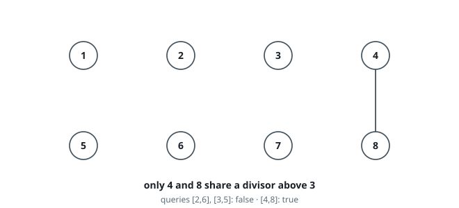
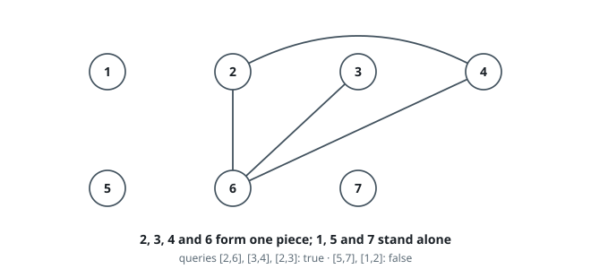
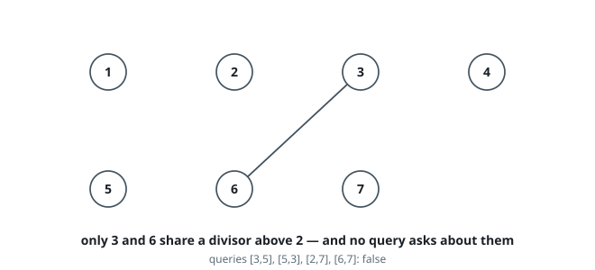

# Linked by a Shared Divisor

## Description

The integers `1` through `n` name `n` nodes. Two distinct labels `x` and `y`
carry an edge between them when some integer `z` divides both of them and
clears the `threshold` — formally, when a `z` exists with:

- `x % z == 0`
- `y % z == 0`
- `z > threshold`

Given `n`, `threshold`, and an array `queries` of pairs, decide for every
`queries[i] = [ai, bi]` whether `ai` and `bi` sit in one connected piece —
joined by an edge directly, or through a chain of edges.

Return a boolean array of the same length as `queries`, `true` wherever such a
chain exists and `false` wherever it does not.

### Example 1

```text
Input: n = 8, threshold = 3, queries = [[2,6],[4,8],[3,5]]
Output: [false,true,false]
Explanation: The divisors above 3 available up to 8 are 4, 5, 6, 7, 8, and a
label can pair with another only over one of them. Just 4 and 8 share such a
divisor (namely 4). Every other label — 2, 6, 3, 5 included — stands alone.
```



### Example 2

```text
Input: n = 7, threshold = 1, queries = [[2,6],[3,4],[2,3],[5,7],[1,2]]
Output: [true,true,true,false,false]
Explanation: Every even label pairs with every other even label over the
divisor 2, and 3 pairs with 6 over 3, so 2, 3, 4 and 6 form one piece. The
labels 1, 5 and 7 have no divisor above 1 in common with anyone.
```



### Example 3

```text
Input: n = 7, threshold = 2, queries = [[3,5],[5,3],[2,7],[6,7]]
Output: [false,false,false,false]
Explanation: Only 3 and 6 share a divisor above 2 (the divisor 3), and no
query happens to ask about that pair. Note [3,5] and [5,3] are the same
question asked twice, in both orders.
```



### Constraints

- `2 <= n <= 10⁴`
- `0 <= threshold <= n`
- `1 <= queries.length <= 10⁵`
- `queries[i].length == 2`
- `1 <= ai, bi <= n`
- `ai != bi`

## Hints

### Hint 1

The edge set can be quadratic in size, but the queries never ask about edges
— only about which labels land in the same connected piece.

### Hint 2

For each `z` above the `threshold`, `z` and every multiple `2z, 3z, …` up to
`n` necessarily share `z`, so they all belong to one piece.

### Hint 3

Group those pieces with a disjoint-set union, then answer each query by
comparing representatives.
