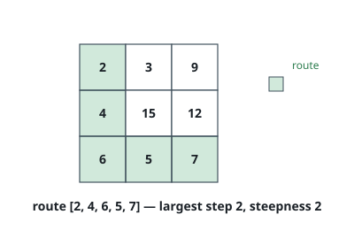
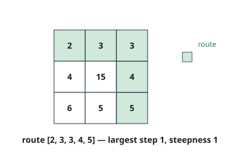
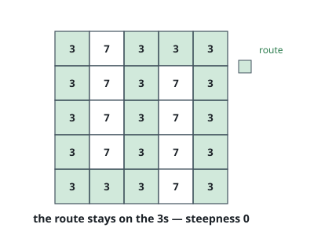

# Flattest Route Across a Grid

## Description

A 2D array `heights` of size `rows x columns` gives the height of every cell:
`heights[row][col]` is the height at `(row, col)`. A route travels from the
top-left cell `(0, 0)` to the bottom-right cell `(rows-1, columns-1)`, moving
repeatedly to a neighboring cell — up, down, left, or right.

The steepness of a route is the largest height difference between two
consecutive cells it crosses. Return the smallest steepness any route can
achieve.

### Example 1

```text
Input: heights = [[2,3,9],[4,15,12],[6,5,7]]
Output: 2
Explanation: The route [2,4,6,5,7] runs down the left column and along the
bottom row; its steepest step is 2. The top route [2,3,9,12,7] has to climb
from 3 to 9, a step of 6.
```



### Example 2

```text
Input: heights = [[2,3,3],[4,15,4],[6,5,5]]
Output: 1
Explanation: Here the top row eases across: the route [2,3,3,4,5] along the
top and right side never climbs or drops more than 1.
```



### Example 3

```text
Input: heights = [[3,7,3,3,3],[3,7,3,7,3],[3,7,3,7,3],[3,7,3,7,3],[3,3,3,7,3]]
Output: 0
Explanation: The cells at height 3 form a corridor from corner to corner, so
a route exists whose every step is flat.
```



### Constraints

- `rows == heights.length`
- `columns == heights[i].length`
- `1 <= rows, columns <= 100`
- `1 <= heights[i][j] <= 10⁶`

## Hints

### Hint 1

Regard the grid as a graph: each cell is a vertex, and each pair of
neighboring cells is an edge whose weight is their height difference.

### Hint 2

For a candidate cap `k`, ask a simpler question: can the corner be reached
using only edges of weight at most `k`?

### Hint 3

That simpler question is monotone in `k`, so binary search it — or change
Dijkstra's sum to a max, which settles cells by smallest steepest step
directly.
