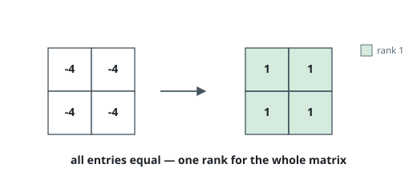
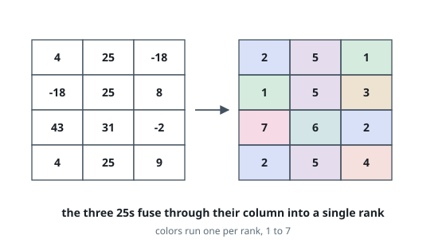

# Rank Every Matrix Entry

## Description

Given an `m x n` matrix, build a second matrix `answer` of the same shape
whose entry `answer[row][col]` is the **rank** of `matrix[row][col]` — an
integer recording where that entry stands among its peers.

Ranks obey three rules:

- Every rank is a positive integer, and `1` is the smallest used.
- Two entries that lie in a common row or a common column rank exactly as
  their values compare: smaller value → smaller rank, equal value → equal
  rank, larger value → larger rank.
- Subject to those constraints, every rank is as low as it can be.

The inputs are such that exactly one matrix satisfies the rules.

### Example 1

```text
Input: matrix = [[2,9],[4,7]]
Output: [[1,4],[2,3]]
Explanation: The 2 is the smallest entry anywhere near it, so it ranks 1.
The 4 outranks 2 down the first column, and the 7 outranks 4 across the
second row, so they take 2 and 3. The 9 tops both the 2 (its row) and the 7
(its column) and takes 4.
```

![The matrix [[2,9],[4,7]] beside its rank matrix [[1,4],[2,3]], one color per rank.](figures/example-1.svg)

### Example 2

```text
Input: matrix = [[-4,-4],[-4,-4]]
Output: [[1,1],[1,1]]
Explanation: Every pair of entries compares equal somewhere along a shared
row or column, so a single rank covers the whole matrix.
```



### Example 3

```text
Input: matrix = [[4,25,-18],[-18,25,8],[43,31,-2],[4,25,9]]
Output: [[2,5,1],[1,5,3],[7,6,2],[2,5,4]]
```



### Constraints

- `m == matrix.length`
- `n == matrix[i].length`
- `1 <= m, n <= 500`
- `-10⁹ <= matrix[row][col] <= 10⁹`

## Hints

### Hint 1

Visit the entries ordered by value, weakest first; when you reach an entry,
every entry it must outrank is already ranked.

### Hint 2

A fresh rank has to top the largest rank so far in its row and in its
column — keep those running maxima.

### Hint 3

Entries with one value that share a row or a column (directly or through a
chain) are locked to a single rank: tie them together with a union-find.
