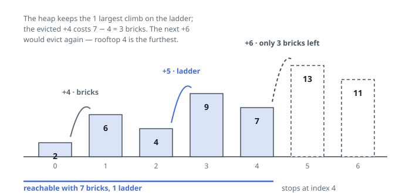

# Solutions — Skyline Walk With Bricks and Ladders

## Greedy ladder reservation

Every climb must be bought with one ladder or its own height in bricks, and
the goal is to stretch the walk as far as it will go. The exchange that
settles everything: whenever a past choice turns out wasteful, the better
policy would have put a ladder on the tallest climb so far and bricks on the
milder ones, since a ladder rescues precisely the brick cost of whatever
climb it stands on.

Keep a min-heap of the climbs currently standing on ladders. Feed it every
positive climb as it appears; the moment it holds more than `ladders`
climbs, the smallest one drops out and is paid for in bricks. The first time
the brick balance dips below zero, no rearrangement of the past can rescue
the step from `i` to `i + 1` — so `i` is the answer. A sweep that ends
without going bankrupt covers every climb, and the last index comes back.

Nothing ever needs undoing: at each point in the sweep the heap holds exactly
the `ladders` tallest climbs so far, which is the assignment spending the
fewest bricks on that prefix and therefore the one that carries the stocks
furthest. Descents and level steps pass for free, `ladders = 0` simply pays
every climb immediately, and the heap never holds more than `ladders + 1`
climbs.

**Complexity:** `O(n log L)` time, `O(L)` space, where `L` is the number of
ladders.
