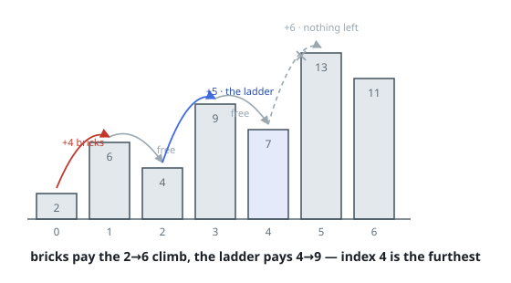

# Skyline Walk With Bricks and Ladders

## Description

An integer array `heights` lists the rooftop levels of a row of buildings,
and you start on rooftop `0`, walking toward the far end of the row. You
carry a stock of `bricks` and a stock of `ladders`.

Stepping from rooftop `i` to rooftop `i + 1` works like this:

- If the next rooftop sits level with or below the current one, the step
  costs nothing.
- If it sits higher, you must either set **one ladder** against the climb or
  spend `heights[i+1] - heights[i]` **bricks** getting up it.

Return the largest index you can stand on, given the wisest possible use of
the bricks and ladders.

### Example 1

```text
Input: heights = [2,6,4,9,7,13,11], bricks = 7, ladders = 1
Output: 4
Explanation: From rooftop 0:
- Step to 1 by paying 4 bricks for the 2-to-6 climb.
- Step to 2 freely, since 6 >= 4.
- Step to 3 by setting the ladder on the 4-to-9 climb.
- Step to 4 freely, since 9 >= 7.
The next climb, 7 to 13, wants 6 bricks or a second ladder, and neither is
left, so rooftop 4 is as far as the walk goes.
```



### Example 2

```text
Input: heights = [3,10,1,8,5,16,18,4,15], bricks = 12, ladders = 2
Output: 7
```

### Example 3

```text
Input: heights = [12,5,20,6], bricks = 15, ladders = 0
Output: 3
Explanation: The single climb, 5 to 20, costs exactly the 15 bricks on hand,
and both other steps run downhill.
```

### Constraints

- `1 <= heights.length <= 10⁵`
- `1 <= heights[i] <= 10⁶`
- `0 <= bricks <= 10⁹`
- `0 <= ladders <= heights.length`

## Hints

### Hint 1

Try first to answer a yes/no version: with these stocks, is rooftop `k`
reachable at all? The furthest reachable index is where that answer flips.

### Hint 2

Every climb must be bought — one ladder, or its height in bricks — and a
ladder is worth exactly the height of the climb it covers. The ladders
belong on the tallest climbs seen so far.

### Hint 3

Sweep left to right holding the ladder-covered climbs in a min-heap and a
running brick total: whenever the heap outgrows the ladder stock, its
smallest climb comes off and is paid in bricks. The first step that drives
the bricks negative is unreachable.
