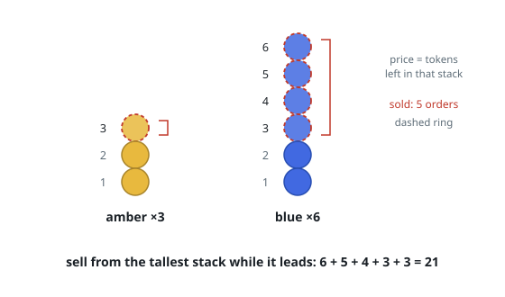

# Sell Tokens From Shrinking Stacks

## Description

You hold several stacks of tokens, given as an integer array `stacks`, where
`stacks[i]` is the number of tokens standing in stack `i`. A buyer wants
exactly `orders` tokens and prices them by an unusual rule: a token leaving a
stack that currently holds `s` tokens sells for `s`.

Handing over a token shrinks its stack by one, so tokens taken later from
the same stack fetch lower and lower prices. Which stack each sold token
comes from is entirely your choice.

Return the largest total the sale can fetch, modulo `10⁹ + 7`.

### Example 1

```text
Input: stacks = [3,6], orders = 5
Output: 21
Explanation: Sell from the tall stack while it leads: 6, then 5, then 4,
which levels both stacks at 3. The last two tokens each fetch 3.
6 + 5 + 4 + 3 + 3 = 21.
```



### Example 2

```text
Input: stacks = [4,4], orders = 6
Output: 18
Explanation: The two stacks stay level, so tokens come off in pairs:
4 + 4 + 3 + 3 + 2 + 2 = 18.
```

### Constraints

- `1 <= stacks.length <= 10⁵`
- `1 <= stacks[i] <= 10⁹`
- `1 <= orders <= min(sum(stacks), 10⁹)`

## Hints

### Hint 1

The priciest token available always sits on a tallest stack — but selling
one token at a time is far too slow for the given sizes.

### Hint 2

Some level `k` exists with every token priced above `k` sold, plus zero or
more tokens priced exactly `k`.

### Hint 3

Binary search for that level `k`, then add up each stack's contribution in
closed form with arithmetic series.
