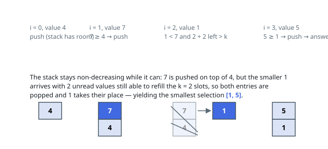

# Solutions — Smallest Fixed-Length Subsequence

## Monotonic Stack

Reading "smallest from left to right" as plain lexicographic minimality
over length-`k` selections points straight at the textbook greedy: a
non-decreasing stack built in a single sweep. Each arriving value first
clears the deck — while the top of the stack is strictly larger than the
newcomer, and enough of the input is still unread to rebuild a length-`k`
selection, the top is discarded. The guard `len(stack) + (n - i) > k`
expresses that budget exactly: a popped entry must leave behind at least
`k` possible picks, counting the newcomer itself.

A survivor or newcomer is appended only while the stack is short of `k`;
once full, the selection changes solely through eviction above, never
through growth. The sweep ends with exactly `k` entries — reachable
whenever `k <= n`, as the constraints promise.

The strictly-greater test matters: swapping an entry for a later equal
one leaves the selection reading identically, so keeping the earlier
occurrence costs nothing and keeps the pass stable around duplicates.
Every entry is pushed once and popped at most once, so the inner `while`
cannot make the pass superlinear.

**Complexity:** `O(n)` time, `O(k)` space.
