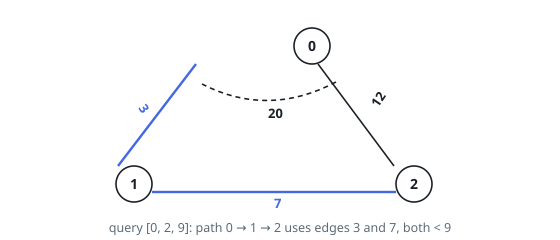
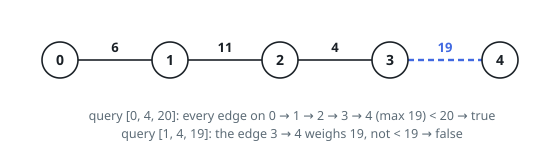

# Paths Under an Edge-Weight Cap

## Description

An undirected graph on `n` nodes arrives as `edgeList`, where
`edgeList[i] = [u_i, v_i, w_i]` is an edge joining `u_i` and `v_i` with
weight `w_i`. Two nodes may be joined by several edges at different
weights.

Alongside it comes `queries`, where `queries[j] = [p_j, q_j, cap_j]`.
For each query, decide whether some path from `p_j` to `q_j` exists on
which **every** edge weighs strictly less than `cap_j`.

Return one boolean per query, in order — `true` when such a path
exists, `false` when it does not.

### Example 1

```text
Input: n = 3, edgeList = [[0,1,3],[1,2,7],[2,0,12],[1,0,20]], queries = [[0,1,3],[0,2,9],[0,1,4]]
Output: [false,true,true]
Explanation: Nodes 0 and 1 are joined by two edges, weighing 3 and 20.
The first query demands every edge weigh under 3, and the direct 3
fails that test, so no qualifying path exists.
The second query succeeds via 0 -> 1 -> 2, whose edges weigh 3 and 7,
both under 9. Under the third cap of 4, the direct edge weighing 3
already qualifies.
```



### Example 2

```text
Input: n = 5, edgeList = [[0,1,6],[1,2,11],[2,3,4],[3,4,19]], queries = [[0,4,20],[1,4,19],[2,4,19]]
Output: [true,false,false]
Explanation: The whole chain 0 -> 1 -> 2 -> 3 -> 4 tops out at 19, under
the first cap of 20. The second and third caps equal the 19 on the final
edge, and the requirement is strict, so both are rejected.
```



### Constraints

- `2 <= n <= 10⁵`
- `1 <= edgeList.length, queries.length <= 10⁵`
- `edgeList[i].length == 3`
- `queries[j].length == 3`
- `0 <= u_i, v_i, p_j, q_j <= n - 1`
- `u_i != v_i`
- `p_j != q_j`
- `1 <= w_i, cap_j <= 10⁹`
- Two nodes may carry several edges between them.

## Hints

### Hint 1

Every query is on the table before any work begins. Is there an ordering
of them that lets earlier work be reused by later work?

### Hint 2

Raise the cap and the set of admissible edges only grows. Sort the edges
by weight and the queries by cap, then sweep the queries upward while
admitting every edge whose weight stays below the current cap.

### Hint 3

With union-find maintaining the admissible-edge forest, each query
boils down to asking whether its two endpoints share a root.
