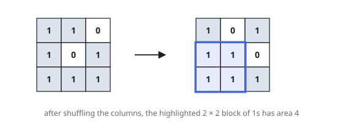
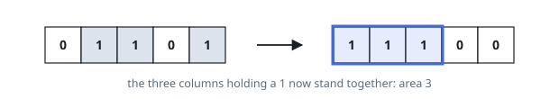

# Largest Ones Block With Shuffled Columns

## Description

You are given a binary matrix `matrix` with `m` rows and `n` columns. You may
shuffle whole columns into any order — each column keeps its entries and moves
as one piece.

Shuffle first, look second: after the shuffle, find the largest rectangle of
`1`s, meaning a block of consecutive rows and consecutive columns whose
entries are all `1`. Return the largest area any shuffle makes possible.

### Example 1

```text
Input: matrix = [[1,1,0],[1,0,1],[1,1,1]]
Output: 4
Explanation: Bring the first and last columns together. Rows 1 and 2 then
hold a 2 × 2 block of 1s, and no shuffle yields more.
```



### Example 2

```text
Input: matrix = [[0,1,1,0,1]]
Output: 3
Explanation: One row, three 1s — group their columns and read off an area of 3.
```



### Example 3

```text
Input: matrix = [[0,1,1],[1,1,0]]
Output: 2
Explanation: Only the middle column is a 1 in both rows, so a two-row block is
one column wide. Grouping a row's pair of 1s also gives area 2 — never more.
```

### Constraints

- `matrix` has `m` rows of equal length `n`
- `1 <= m * n <= 10⁵`
- every entry is `0` or `1`

## Hints

### Hint 1

Per column, count the consecutive `1`s that end at each row — a run that
breaks wherever a `0` sits.

### Hint 2

Columns can be reordered freely, so at each row only the multiset of run
heights matters. Sort the row's heights largest first: for each height `h` in
that order, the columns tall enough to form a block of height `h` are exactly
those standing to its left.
