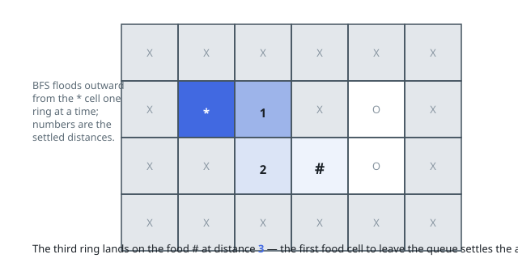

# Solutions — Fewest Steps to a Food Cell

## Breadth-First Search

All four moves cost the same single step, which makes the grid an unweighted
graph — and breadth-first search from the lone start cell is the tool for
exact distances on such a graph: the first visit to any cell already travels a
shortest route. Food cells are destinations, never sources, so one plain
single-source flood from `'*'` is enough; with several food cells around, the
first one out of the queue is by definition the closest.

The sweep locates `'*'` in one pass over the grid, then runs BFS with a `dist`
matrix seeded to `-1` that doubles as the visited marker. Whenever a cell
leaves the queue, it is checked for food — `'#'` — and its recorded distance
is handed back at once; otherwise the four neighbours go in if they lie inside
the grid, are not blocked `'X'`, and have not been seen. Setting `dist` at
enqueue time rather than at dequeue time is what keeps any cell from entering
the queue twice.

If the queue runs dry before any food cell leaves it, no route exists and the
answer is `-1` — this also covers food sealed off completely by blocked cells,
as in the walled-off example. The start itself is never food, and blocked
cells take no part in expansion though the initial scan reads past them.

**Complexity:** `O(mn)` time, `O(mn)` space.
