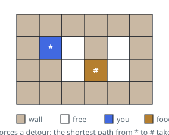
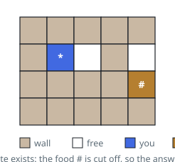
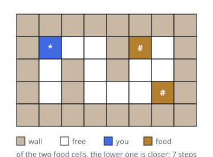

# Fewest Steps to a Food Cell

## Description

You are given an `m x n` grid of cells, four kinds in all:

- `'*'` — where you stand. Exactly one cell of this kind exists.
- `'#'` — food. There may be several food cells.
- `'O'` — open floor you may walk across.
- `'X'` — a blocked cell you may not enter.

Each move steps to the cell north, east, south, or west of your current one,
provided it is not blocked. Walking counts one step per move.

Return the fewest steps needed to stand on any food cell, or `-1` if no
sequence of moves reaches food at all.

### Example 1

```text
Input: grid = [["X","X","X","X","X","X"],["X","*","O","X","O","X"],["X","X","O","#","O","X"],["X","X","X","X","X","X"]]
Output: 3
Explanation: The wall east of the start forces a dip south: right, down,
right — three steps to the food.
```



### Example 2

```text
Input: grid = [["X","X","X","X","X"],["X","*","O","X","O"],["X","X","X","X","#"],["X","X","X","X","X"]]
Output: -1
Explanation: A full wall column seals off the corner, and the food there is
unreachable.
```



### Example 3

```text
Input: grid = [["X","X","X","X","X","X","X","X"],["X","*","O","O","X","#","O","X"],["X","O","X","O","X","O","O","X"],["X","O","X","O","O","O","#","X"],["X","X","X","X","X","X","X","X"]]
Output: 7
Explanation: Two food cells sit in the maze. The nearer of the two costs 7
steps.
```



### Example 4

```text
Input: grid = [["*","O"],["O","#"]]
Output: 2
Explanation: Down, then right.
```

### Constraints

- `grid` has `m` rows of equal length `n`
- `1 <= m, n <= 200`
- every cell is `'*'`, `'X'`, `'O'`, or `'#'`
- exactly one `'*'` cell exists

## Hints

### Hint 1

Every move costs the same one step, so treat the grid as an unweighted graph
and flood outward from the `'*'` cell.

### Hint 2

Carry the step count along in the queue so each cell knows how far it sits
from the start.

### Hint 3

The moment a food cell leaves the queue, its step count is the answer — no
shorter route to it can appear later.

### Hint 4

A queue that empties without any food leaving it means food was never reached:
return `-1`.
