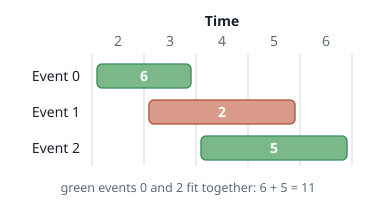
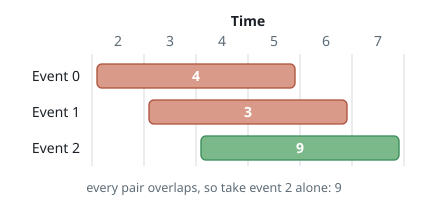
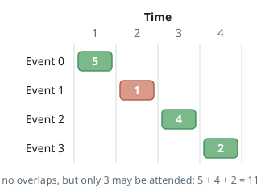

# Best Value From at Most k Events

## Description

You are given a list of `events`, where `events[i] = [start, end, value]`.
Event `i` runs from day `start` through day `end`, both inclusive, and pays
`value` to anyone who attends all of it. You are also given an integer `k`,
the largest number of events you may attend.

Two events clash when their day ranges share a day — even a single shared day
counts, since an event runs through its closing day. You can hold at most one
event at a time, and attending fewer than `k` events is allowed.

Return the largest total value you can collect.

### Example 1

```text
Input: events = [[2,3,6],[3,5,2],[4,6,5]], k = 2
Output: 11
Explanation: Event 0 closes on day 3 and event 2 opens on day 4, so they
chain nicely for 6 + 5 = 11. The middle event overlaps both and stays home.
```



### Example 2

```text
Input: events = [[2,5,4],[3,6,3],[4,7,9]], k = 2
Output: 9
Explanation: Every pair of events shares a day, so no two can be combined;
the single best payoff is 9.
```



### Example 3

```text
Input: events = [[1,1,5],[2,2,1],[3,3,4],[4,4,2]], k = 3
Output: 11
Explanation: The four events never clash, but only three may be attended —
skip the cheapest and take 5 + 4 + 2.
```



### Constraints

- `1 <= k <= events.length`
- `1 <= k * events.length <= 10⁶`
- each event is a triple `[start, end, value]`
- `1 <= start <= end <= 10⁹`
- `1 <= value <= 10⁶`

## Hints

### Hint 1

Order the events by closing day. Any clash-free selection, read in that
order, is a run of compatible neighbours, so each chosen event only has to
agree with the one chosen before it.

### Hint 2

Let `dp[i][j]` be the best total from the first `i` sorted events attending at
most `j`. Express it through `dp[i-1][j]` (pass on event `i`) and through
event `i` stacked on the best compatible earlier state.

### Hint 3

The events compatible with event `i` are exactly those closing strictly before
its opening day — a prefix of the sorted order, whose length a binary search
over the sorted closing days finds.
