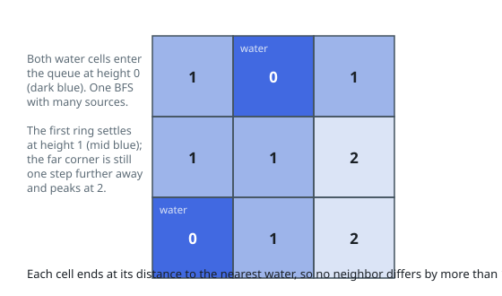

# Solutions — Terrain Height Map

## Multi-Source BFS from Water

The two rules clamp every cell from above and below at once: water is pinned at
`0`, and each shared edge can move a height by at most `1`, so a land cell can
never exceed its walking distance to the closest water. Filling the grid with
exactly those distances therefore pushes every cell to its individual ceiling
simultaneously — neighboring distances differ by at most `1` because a path
reaching one of them passes through the other — which both maximizes the
tallest cell and gives each cell the least height that maximum allows.

Distances on an unweighted grid call for one breadth-first search seeded with
every water cell. The code scans `isWater`, sets those cells to height `0`, and
pushes them all into the queue; the search then expands ring by ring, and each
newly touched neighbor receives `height[i][j] + 1`. Because `height` starts at
`-1` and doubles as the visited marker, no cell is enqueued twice — it is
settled by whichever source reaches it first, which is the nearest one.

BFS covers the whole grid, and the promised water cell keeps the initial queue
from being empty. Maps whose water hugs one edge leave deep interior corners,
which is precisely where the tallest heights arise; ties are impossible to
exploit, since going below the nearest-water distance would break the bound
above.

**Complexity:** `O(mn)` time, `O(mn)` space.
