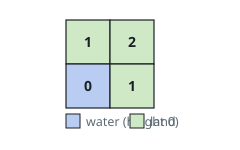
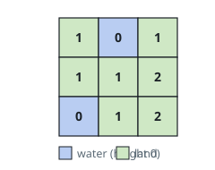

# Terrain Height Map

## Description

You are given an `m x n` integer matrix `isWater` that describes a grid of
terrain cells: `isWater[i][j] == 1` marks a water cell, and `isWater[i][j] == 0`
marks a land cell.

Assign each cell a height so that all of the following hold:

- Every height is a non-negative integer.
- A water cell receives height `0`.
- Two cells that share an edge differ in height by at most `1`.

Make the tallest cell in the grid as tall as the rules allow. Return the
`m x n` matrix `height`, where `height[i][j]` is the height you gave cell
`(i, j)`; when several assignments reach that tallest cell, give every other
cell the smallest height the rules permit.

### Example 1

```text
Input: isWater = [[0,0],[1,0]]
Output: [[1,2],[0,1]]
Explanation: The single water cell sits in the bottom-left corner. The cell
diagonally opposite it is two steps from any water, so it peaks at height 2;
the remaining two cells are one step away.
```



### Example 2

```text
Input: isWater = [[0,1,0],[0,0,0],[1,0,0]]
Output: [[1,0,1],[1,1,2],[0,1,2]]
Explanation: Water occupies the top-middle and bottom-left cells. No cell is
more than two steps from water, so 2 is the tallest the grid can get, and both
far-right cells reach exactly that.
```



### Constraints

- `isWater` is `m x n` with `1 <= m, n <= 1000`
- each `isWater[i][j]` is `0` or `1`
- the grid contains at least one water cell

## Hints

### Hint 1

Water sits at height `0`, and crossing each edge can change a height by at most
`1` — so no cell can stand taller than its walking distance to the nearest
water.

### Hint 2

Those distances are what a breadth-first search computes, provided every water
cell starts in the queue at once.
