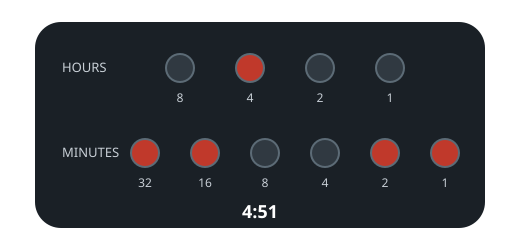

# Led Clock Faces

## Description

A clock face shows the time with two rows of LEDs: the top four LEDs encode
the hour in binary (values 8, 4, 2, 1, together covering 0-11) and the bottom
six encode the minute in binary (values 32, 16, 8, 4, 2, 1, together covering
0-59). Each LED is either lit (`1`) or dark (`0`), with the least significant
bit on the right.

For example, the face below reads `4:51`.



```text
Hours:    8  4  2  1         0 1 0 0
Minutes: 32 16  8  4  2  1   1 1 0 0 1 1
```

Given an integer `turnedOn` giving the number of lit LEDs, return every time
of day the face could be showing. Order the times chronologically: hours
ascending from `0` to `11`, and minutes ascending within each hour.

Format each time with no leading zero on the hour (write `"1:00"`, not
`"01:00"`) and exactly two minute digits, leading zero allowed (write
`"10:02"`, not `"10:2"`).

### Example 1

```text
Input: turnedOn = 0
Output: ["0:00"]
```

### Example 2

```text
Input: turnedOn = 8
Output: ["7:31","7:47","7:55","7:59","11:31","11:47","11:55","11:59"]
```

### Example 3

```text
Input: turnedOn = 10
Output: []
Explanation: No hour/minute pair has ten lit LEDs between them.
```

### Constraints

- `0 <= turnedOn <= 10`

## Hints

### Hint 1

A time is valid when the lit-hour count plus the lit-minute count equals
`turnedOn`, and a number's lit count is its popcount.

### Hint 2

The full time grid has only 12 x 60 cells — enumerate them all.
