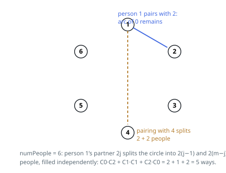

# Solutions — Count Non-Crossing Circle Pairings

## The Catalan recurrence from one pinned chord

Fix any person — call them person 1 — and enumerate only their partner.
The two of them form a chord, and that chord is a wall: any handshake
joining the two arcs it separates would have to cross it, so each arc
pairs up strictly within itself. Once person 1's partner is fixed, the
layout is a layout of the left arc times a layout of the right arc, with
nothing shared between them.

If the whole table holds `i` pairs, a partner sitting so that one arc
holds `j` pairs leaves `i - 1 - j` pairs in the other, and summing over
every legal partner gives

`ways[i] = Σ_j ways[j] · ways[i-1-j]`, anchored by `ways[0] = 1` — an
empty arc admits exactly one arrangement, the empty one. This is the
Catalan recurrence in the wild; `ways[i]` is the `i`-th Catalan number,
which is why six people already reach five layouts and eighteen reach 4862.

The table fills bottom-up from `ways[0]`, each entry the convolution of
the entries before it, reduced modulo `10^9 + 7` term by term so partial
sums stay bounded. Only the pair count survives into the computation — the
geometry is spent entirely by the split argument, which is also what
enforces the parity a partner needs: an arc with an odd head-count could
never pair itself, and indeed those partner choices contribute nothing.
The smallest input, two people, lands at `ways[1] = ways[0]·ways[0] = 1`:
one handshake, one layout.

**Complexity:** `O(m²)` time, `O(m)` space, for `m = numPeople / 2` pairs.
