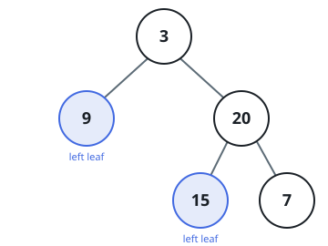

# Left Leaf Total

## Description

A node with no children is a **leaf**. A **left leaf** is a leaf that hangs
off its parent as the left child.

Given the `root` of a binary tree, return the sum of all left-leaf values.

### Example 1



```text
Input: root = [3,9,20,null,null,15,7]
Output: 24
Explanation: The left leaves are 9 (left child of 3) and 15 (left child of 9);
20 and 7 are right children.
```

### Example 2

```text
Input: root = [1,null,2]
Output: 0
Explanation: Node 2 is a leaf but hangs off the right side, so nothing is
summed.
```

### Example 3

```text
Input: root = [3,9,20,15,7]
Output: 15
Explanation: Node 15 is a left child of 9 and a leaf; node 7 is a right leaf.
```

### Constraints

- The number of nodes in the tree is in the range `[1, 1000]`.
- `-1000 <= Node.val <= 1000`
