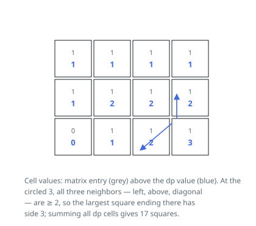

# Solutions — Count All-Ones Squares

## DP on the Largest Square Ending at Each Cell

Let `dp[i][j]` be the side length of the biggest all-ones square whose
bottom-right corner is the cell `(i, j)`. A 0 cell closes no square, so its
value is 0. Otherwise the square can only be as deep as the three
already-computed neighbors allow — the cell above, the cell to the left, and
the diagonal above-left — and the value is one plus the smallest of the
three. Cells on the top row or left column have no room to spread and cap at 1.

Why summing the table counts every square exactly once: an all-ones square
of side `k` is pinned down by its bottom-right corner, and the corner's
value `d` means sides `1, 2, …, d` all close there — the `k` nested squares
inside a corner of max side `d ≥ k` are each accounted for by that one
number. So the answer is the sum of all `dp` values, with no loop over side
lengths.

The code sweeps the grid row by row and keeps only the finished previous row
(`prev`) while filling the current one (`cur`), so the full table is never
stored. A 0 entry is simply skipped and stays 0.

Corner behavior falls out of the border rule: an all-zero grid sums to 0, a
single row or column contributes one square per 1, and squares can never
reach past the grid edge because row 0 and column 0 are capped at 1.

**Complexity:** `O(m · n)` time, `O(n)` space.
