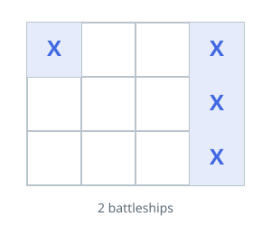

# Warship Grid Count

## Description

An `m x n` grid `board` marks the cells of warships with `'X'` and empty
water with `'.'`. Count how many warships occupy the grid.

Every warship is a straight run of `'X'` cells, either a horizontal strip of
shape `1 x k` or a vertical strip of shape `k x 1`, for any size `k`. A ship
never touches another ship: at least one `'.'` cell separates ships both
horizontally and vertically.

### Example 1



```text
Input: board = [["X",".",".","X"],[".",".",".","X"],[".",".",".","X"]]
Output: 2
```

### Example 2

```text
Input: board = [["X","X",".","X"],[".",".",".","X"],["X",".","X","."]]
Output: 4
```

### Constraints

- `m == board.length`
- `n == board[i].length`
- `1 <= m, n <= 200`
- `board[i][j]` is either `'.'` or `'X'`.

### Follow-up

Can you count the ships in one pass, using only `O(1)` extra memory and
without modifying `board`?
