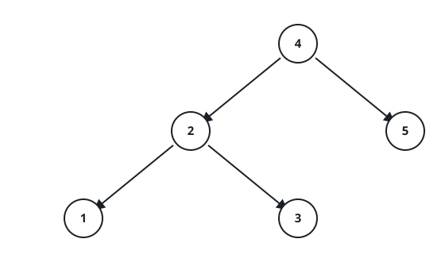
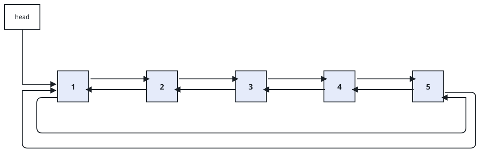
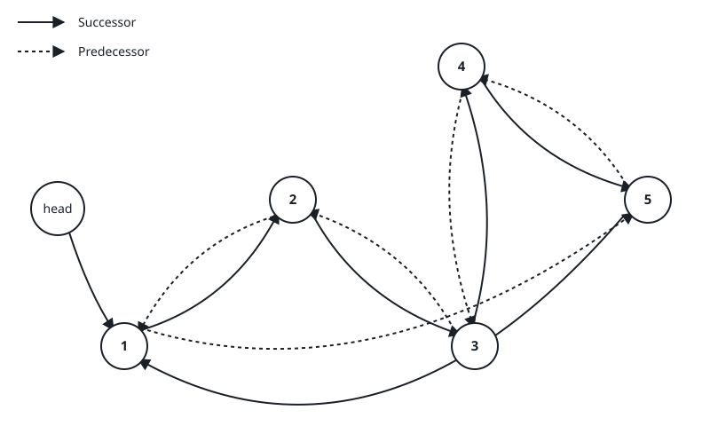

# Sorted Ring From BST

## Description

Turn a binary search tree into a sorted, circular, doubly linked list, using
the tree's own nodes. Reuse the `left` and `right` pointers as the backward
and forward links of the list: after the transformation, each node's `left`
points to its predecessor and each node's `right` points to its successor. A
circular list links its two ends to each other as well, so the predecessor of
the smallest node is the largest node, and the successor of the largest node
is the smallest. Return the smallest node of the ring.

No new nodes may be allocated.

On the wire the tree arrives as a level-order array of values, and the answer
is the ring's values read from the smallest node, following successor links
around the circle; an empty tree answers `[]`.

### Example 1



```text
Input: root = [4,2,5,1,3]
Output: [1,2,3,4,5]
```





### Example 2

```text
Input: root = [5,3,8,2,4]
Output: [2,3,4,5,8]
```

### Constraints

- The number of nodes in the tree is in the range `[0, 2000]`.
- `-1000 <= Node.val <= 1000`
- All node values are unique.
