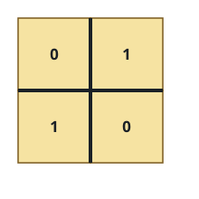
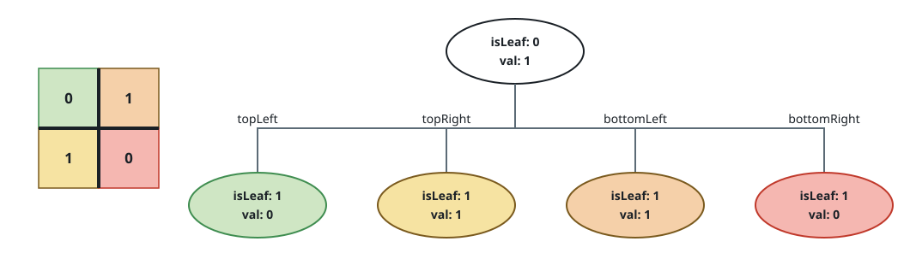
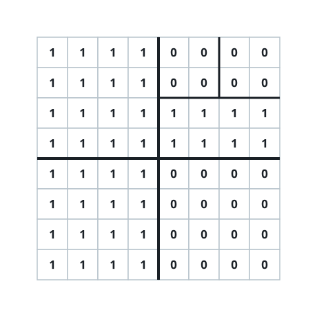
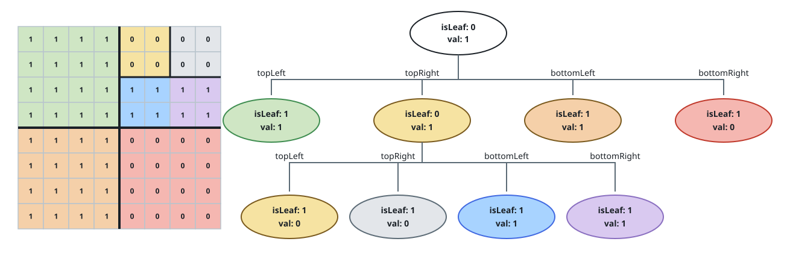

# Build Quad-Tree

## Description

You are given an `n x n` binary matrix `grid` whose cells are `0` or `1`.
Build and return the root of the quad tree that represents it.

A quad tree is a tree in which every internal node has exactly four
children, named `topLeft`, `topRight`, `bottomLeft`, and `bottomRight`.
Each node has two boolean attributes:

- `val` — `True` when the node's region holds only `1`s, `False` when it
  holds only `0`s. For a non-leaf node this value is arbitrary.
- `isLeaf` — `True` for a leaf, `False` for an internal node.

A node is built from its region with this rule: if every cell in the
region shares one value, emit a leaf carrying that value. Otherwise emit an
internal node and recurse on the four equal quadrants of the region.

### Example 1





```text
Input: grid = [[0,1],[1,0]]
Output: [[0,0],[1,0],[1,1],[1,1],[1,0]]
Explanation: The two-by-two grid is not uniform, so the root is internal.
Each quadrant is a single uniform cell, so each is a leaf.
```

### Example 2





```text
Input: grid = [[1,1,1,1,0,0,0,0],[1,1,1,1,0,0,0,0],[1,1,1,1,1,1,1,1],[1,1,1,1,1,1,1,1],[1,1,1,1,0,0,0,0],[1,1,1,1,0,0,0,0],[1,1,1,1,0,0,0,0],[1,1,1,1,0,0,0,0]]
Output: [[0,0],[1,1],[0,0],[1,0],[1,0],[1,1],[1,1],[1,1],[1,0]]
Explanation: Only the top-right quadrant is non-uniform; it splits into
four uniform leaves.
```

### Example 3

```text
Input: grid = [[1]]
Output: [[1,1]]
Explanation: A single uniform cell is already a leaf carrying value 1.
```

The output uses the serialized form of a quad tree: each node is a pair
`[isLeaf, val]` with booleans written as `1`/`0`, and an internal node is
followed by its four children in `topLeft, topRight, bottomLeft,
bottomRight` order. A non-leaf's `val` is normalized to `0` in this
display.

### Constraints

- `n == grid.length == grid[i].length`
- `n == 2^x` for some integer `x` with `0 <= x <= 6`
