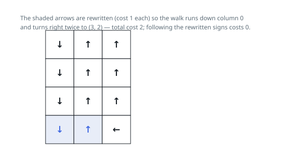

# Solutions — Rewrite Signs to Reach the Far Corner

Restate the task as a shortest path: each cell is a node, and stepping from
`(i, j)` to any of its four side-neighbours costs `0` when the cell's sign
already points that way and `1` when it does not — the rewrite price. The
answer is the cheapest accumulated weight along any route from `(0, 0)` to
`(m - 1, n - 1)`. Plain Dijkstra serves that graph unchanged, one
binary-heap pop at a time; and since the only weights are 0 and 1, Dijkstra
folds into 0-1 BFS: keep a deque, always expand the front, and the front is
guaranteed to hold a node at the current minimum distance.

## Dijkstra with a binary heap

The heap stores `(distance, i, j)` records, and every pop hands back the
smallest tentative distance still in play. With non-negative weights that
pop is already final — any other route to the cell would have to arrive as
a record with a larger key — so the first time a cell leaves the heap its
distance is settled, and the first pop of `(m - 1, n - 1)` returns on the
spot; a `1 x 1` grid answers 0 on the opening pop.

Relaxation prices the four neighbours of `(i, j)` exactly as the task does:
`0` along the sign, `1` against it, and the bounds check drops the steps a
sign aims off the grid. Only a strict improvement over `dist[ni][nj]`
writes the table and queues a record, and records are pushed lazily — a
cell improved twice waits in the heap twice — so a stale-entry guard
(`d > dist[i][j]`) discards the outdated copy, and each cell is expanded at
most once.

None of this exploits the 0/1 weights: keeping the records ordered is
exactly the work the deque in the next section does for free, and that is
where the `log` factor below comes from.

**Complexity:** `O(m * n * log(m * n))` time, `O(m * n)` space.

## 0-1 BFS with a deque

The relaxation is what keeps the deque ordered. A neighbour improved along
a free edge is pushed to the front (`appendleft`); one improved along a
paid edge goes to the back (`append`) — so distances never fall off from
front to back by more than the single unit separating the two halves, and
each node is settled the first time it leaves the queue. A node can be
re-pushed when a strictly shorter distance turns up later; the `dist`
table blocks any worse expansion.

Walking the input is one `dirs` map from sign values `1-4` to their
`(di, dj)` offsets; each dequeued cell probes all four directions, so every
cell-to-cell adjacency is priced a constant number of times per improvement.
The start begins at distance 0 — entering a cell is free; only leaving it
against its sign costs.

Edges behave: a `1 x 1` grid returns 0 at once (start and goal coincide),
signs aimed off the grid are simply never followed — the bounds check
drops those steps, and redirecting such a sign is exactly the paid edge
into an interior neighbour. In the first example the whole first column
points down for free, so distance 0 reaches `(3, 0)`; the two right turns
are the two paid edges, giving the answer 2.

**Complexity:** `O(m * n)` time, `O(m * n)` space.
