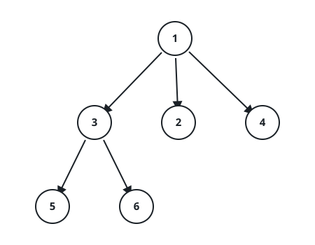
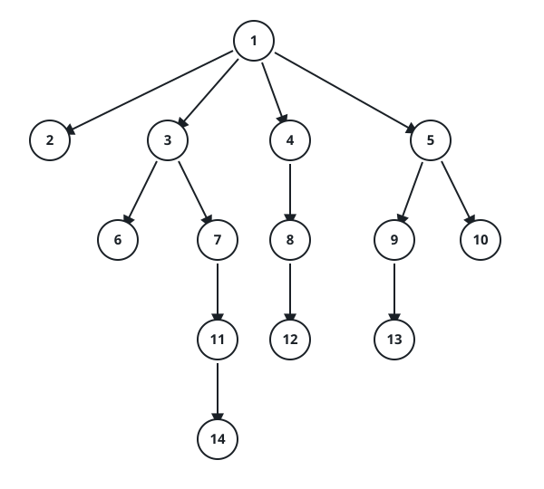

# N-ary Tree Row Order

## Description

Given the root of an N-ary tree, return its values level by level: one
inner list per depth, containing that depth's node values in left-to-right
order. The root alone forms the first row.

An empty tree produces no rows.

### Example 1



```text
Input: root = [1,null,3,2,4,null,5,6]
Output: [[1],[3,2,4],[5,6]]
```

### Example 2



```text
Input: root = [1,null,2,3,4,5,null,null,6,7,null,8,null,9,10,null,null,11,null,12,null,13,null,null,14]
Output: [[1],[2,3,4,5],[6,7,8,9,10],[11,12,13],[14]]
```

### Example 3

```text
Input: root = [3,null,1,2,null,6]
Output: [[3],[1,2],[6]]
Explanation: Node 1 has child 6, so the third row holds a single value.
```

### Constraints

- The height of the tree is at most `1000`.
- The total number of nodes is in the range `[0, 10⁴]`.
