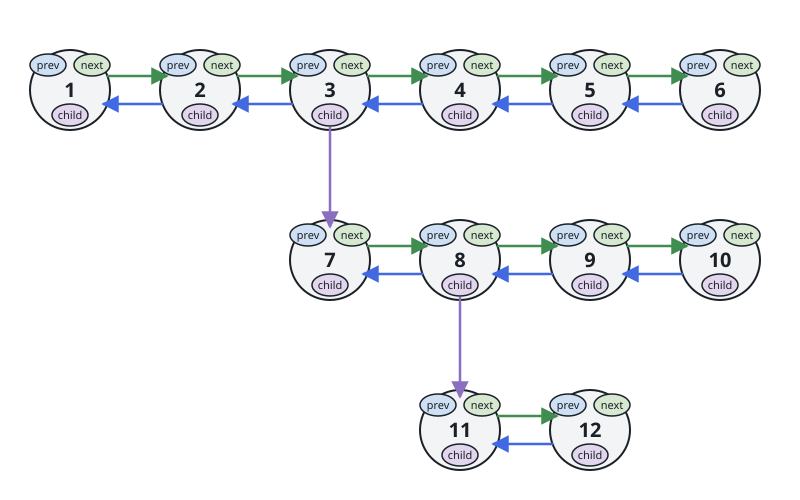
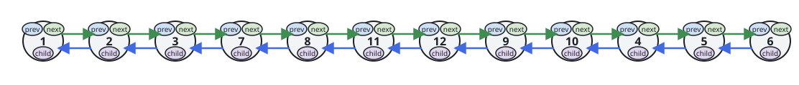
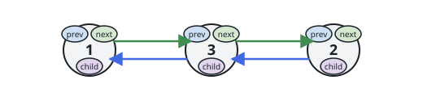

# Unroll Multilevel Linked List

## Description

You are given a doubly linked list whose nodes carry `next` and `prev`
pointers plus an extra `child` pointer. A `child` may point to another
doubly linked list of the same kind, whose own nodes may again have
children, and so on — a multilevel structure.

Flatten it into a single-level doubly linked list: every node in a child
list is spliced in between its parent node and the parent's old `next`.
After flattening, every `child` pointer must be `null`. Return the head of
the flattened list.



On the wire, the input is a chain object `{"values": [...], "children":
[...]}` where `children` has one slot per value, each `null` or another
chain object hanging below that node. The flattened result is reported as
the flat list of values, and `{"values": [], "children": []}` is the empty
list.

### Example 1



```text
Input: head = [{"values": [1,2,3,4,5,6], "children": [null,null,{"values": [7,8,9,10], "children": [null,{"values": [11,12], "children": [null,null]},null,null]},null,null,null]}]
Output: [1,2,3,7,8,11,12,9,10,4,5,6]
Explanation: The child chain 7-8-9-10 hangs under node 3, and 11-12 hangs
under node 8, so the flattened walk is 1, 2, 3, then the child subtree,
then the rest of the top level.
```

### Example 2


```text
Input: head = [{"values": [1,2], "children": [{"values": [3], "children": [null]},null]}]
Output: [1,3,2]
Explanation: Node 1's child 3 is spliced between 1 and 2.
```



### Example 3

```text
Input: head = [{"values": [], "children": []}]
Output: []
Explanation: An empty chain stays empty.
```

### Example 4

```text
Input: head = [{"values": [10,20], "children": [null,null]}]
Output: [10,20]
Explanation: With no child lists, flattening leaves the order untouched.
```

### Constraints

- The number of nodes does not exceed `1000`.
- `1 <= Node.val <= 10⁵`
