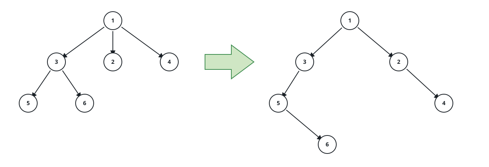

# N-ary to Binary Tree Mapping

## Description

Design a mapping that encodes an N-ary tree into a binary tree and back.
An N-ary tree is a rooted tree whose nodes have up to N children; a binary
tree's nodes have at most two children. A correct encoding may use any
scheme that lets the original tree be recovered.

This judge pins one deterministic scheme so answers can be compared
exactly: the first-child / next-sibling mapping.

- A node's first child becomes its left child.
- Each later child becomes the right child of the previous child in the
  siblings group.
- A childless N-ary node contributes no left child.

In other words, each children group becomes a right-going chain hanging
off the parent's left pointer. Return the root of the binary tree produced
by this mapping, judged by its level-order serialization.



### Example 1

```text
Input: root = [1,null,3,2,4,null,5,6]
Output: [1,3,null,5,2,null,6,null,4]
Explanation: Node 1's first child 3 is its left child; 3's siblings 2 and
4 chain to the right; and 3's own children 5 and 6 form the next chain.
```

### Example 2

```text
Input: root = [5]
Output: [5]
Explanation: A single node maps to a single binary node.
```

### Example 3

```text
Input: root = [1,null,2,3,null,4]
Output: [1,2,null,4,3]
Explanation: Node 1's children 2 and 3 chain right; node 2's child 4 hangs
off 2's left.
```

### Constraints

- The number of nodes is in the range `[0, 10⁴]`.
- `0 <= Node.val <= 10⁴`
- The height of the tree is at most `1000`.
- The encoder must be stateless — no class, global, or static storage.
