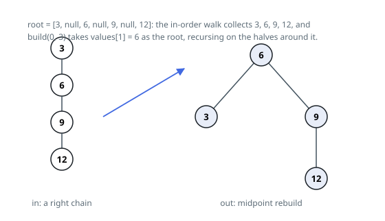

# Solutions — Rebalance a BST

Both solutions flatten the tree into its sorted value order and rebuild a
balanced shape around it, but they part ways on how much extra memory that
costs. The midpoint rebuild spends an explicit array holding every value,
then allocates a brand-new node per position. The mirrored Day-Stout-Warren
rotation allocates nothing at all: it reshapes the tree's own existing
nodes in place through a sequence of rotations, so the whole rebalance runs
inside the input's own pointers.

## In-order flatten, then midpoint rebuild

Two facts pair up neatly here. An in-order walk of a search tree lists its
values in ascending order; and a sorted run of values turns into a balanced
search tree by taking the middle element as the root and repeating on each
half — no split can leave more than half the remaining values on one side, so
subtree depths stay within one of each other everywhere. Rebalancing is thus a
flatten followed by a rebuild.

The flatten is written iteratively, with an explicit stack: descend left as
far as possible while pushing, then pop a node, emit its value, and continue
from its right child. Ten thousand nodes fed in as one straight line —
precisely the shape this task punishes — would overflow recursive traversal,
and the explicit stack sidesteps that.

The rebuild is the recursive `build(lo, hi)`: `mid = (lo + hi) // 2` becomes
the new node, the left child comes from `values[lo..mid-1]` and the right from
`values[mid+1..hi]`, with an empty range yielding `None`. Recursing on halves
keeps its depth logarithmic, so the recursion that would be dangerous in phase
one is safe in phase two. For the chain `[3, null, 6, null, 9, null, 12]`,
the walk collects 3, 6, 9, 12 and `build(0, 3)` crowns `values[1] = 6`,
leaving 3 on the left and 9 (with 12 beneath) on the right.

A one-node tree rebuilds to itself, and the whole construction touches each
value a constant number of times.

**Complexity:** `O(n)` time, `O(n)` space.

## Mirror Day-Stout-Warren Rotation

The Day-Stout-Warren algorithm rebalances a binary search tree by two
in-place passes over its own nodes: first straighten it into a sorted
linked list (a "vine"), then fold that vine into a complete shape with
rotations. This mirrors the textbook version end for end — vine and
compression both run right to left instead of left to right — which
still produces a valid balanced tree over the same values, though not
always the identical shape the midpoint rebuild picks (the statement
accepts either).

Building the vine walks down through a dummy head, always inspecting the
node currently in hand: a node with a right child gets a left rotation —
its right child is promoted above it and inherits it as a left child —
which shortens the remaining tree by one and keeps the walk at the same
spot to check again; a node with no right child is finished, so the walk
steps onto its left child and the vine's length counter grows by one.
When the walk runs out of nodes, every node hangs off the next by a left
pointer alone, in strictly descending value order.

Compression folds that vine upward with right rotations, which are the
mirror image of the left rotations used to build it: every second node
along the vine is promoted above its neighbor, halving the vine's length
each pass. The first pass only promotes the vine's excess over the
largest `2^k - 1` size that fits, so every later pass halves a size that
is already one short of a power of two and finishes evenly. Promoting the
same nodes the array rebuild would have chosen as roots, just reached by
rotation instead of indexing, produces a tree balanced the same way the
midpoint rebuild is — depths across any node's two subtrees differ by at
most one — but reusing the original nodes throughout, an in-order walk
away from the two-phase shape this rebalance mirrors.

**Complexity:** `O(n)` time, `O(1)` space.
