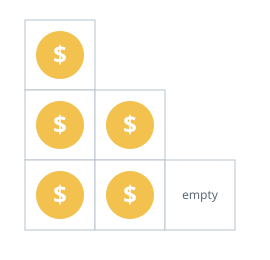
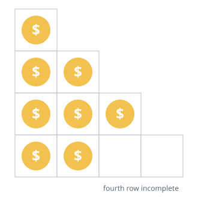

# Staircase Coin Builder

## Description

Use `n` coins to build a staircase in which row `i` holds exactly `i` coins.
Rows are filled from the top, and the final row may be left incomplete.

Return the number of fully completed rows that `n` coins can build.

### Example 1



```text
Input: n = 5
Output: 2
Explanation: Rows 1 and 2 cost 1 and 2 coins; the 3 remaining coins cannot
finish row 3, which demands 3 more.
```

### Example 2



```text
Input: n = 8
Output: 3
Explanation: Rows 1, 2, and 3 consume 6 coins; row 4 needs 4 more and stays
incomplete.
```

### Example 3

```text
Input: n = 15
Output: 5
Explanation: The first five rows cost 15 coins exactly.
```

### Constraints

- `n` is between `1` and `2³¹ - 1`, inclusive.
