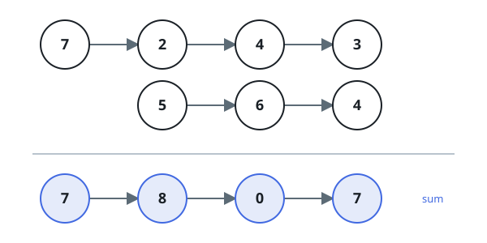

# Backward Digit Sum

## Description

Two non-empty linked lists each spell out a non-negative integer, with the
most significant digit at the head and one digit per node. Add the two
integers and return their sum as a linked list in the same most-significant-
first layout.

Neither input number has a leading zero except the number `0` itself.

### Example 1



```text
Input: l1 = [7,2,4,3], l2 = [5,6,4]
Output: [7,8,0,7]
```

### Example 2

```text
Input: l1 = [9,9], l2 = [1]
Output: [1,0,0]
Explanation: 99 + 1 = 100, so the result grows a new leading digit.
```

### Example 3

```text
Input: l1 = [1,2,3], l2 = [0]
Output: [1,2,3]
```

### Constraints

- Each list has between `1` and `100` nodes.
- Every node value is a single digit from `0` through `9`.
- The numbers have no leading zeros.

### Follow-up

Can you add the numbers without reversing either input list?
