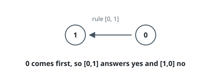
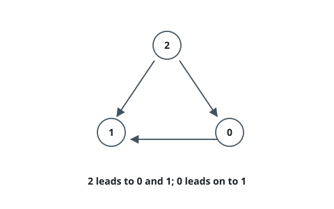

# Course Prerequisite Queries

## Description

A programme numbers its `courseCount` courses `0` through `courseCount - 1`.
The array `prerequisites` lists its ordering rules: an entry `[a, b]` says that
course `a` has to be finished before course `b` may begin.

Rules chain. If one rule places `x` ahead of `y` and another places `y` ahead
of `z`, then `x` is forced ahead of `z` as well, even though no single entry
says so. Call one course a _prerequisite_ of another whenever some chain of
rules forces that order.

Every entry `[u, v]` of `queries` asks one yes-or-no question: is `u` a
prerequisite of `v`? Return the answers as an array, one per query, in the
order asked.

The rules never contradict one another, so no course ends up needing itself.

### Example 1

```text
Input: courseCount = 2, prerequisites = [[0,1]], queries = [[0,1],[1,0]]
Output: [true,false]
Explanation: The lone rule fixes 0 ahead of 1. Nothing stands in front of 0, so
the second question answers no.
```



### Example 2

```text
Input: courseCount = 4, prerequisites = [], queries = [[0,3],[2,1],[3,0]]
Output: [false,false,false]
Explanation: No rules at all means no course constrains any other, and every
question answers no.
```

### Example 3

```text
Input: courseCount = 3, prerequisites = [[2,1],[2,0],[0,1]], queries = [[2,1],[1,0],[0,1]]
Output: [true,false,true]
Explanation: Two rules place 2 in front of both of the others, and a third
places 0 in front of 1. That leaves 1 at the end of the programme, standing in
front of nothing.
```



### Constraints

- `2 <= courseCount <= 100`
- `0 <= prerequisites.length <= courseCount * (courseCount - 1) / 2`
- every entry of `prerequisites` holds exactly two course numbers
- `0 <= a, b < courseCount` and `a != b` for each entry `[a, b]`
- no pair is listed twice in `prerequisites`
- the ordering rules contain no cycle
- `1 <= queries.length <= 10^4`
- `0 <= u, v < courseCount` and `u != v` for each query `[u, v]`

## Hints

### Hint 1

Read a rule `[a, b]` as an arrow drawn from `a` to `b`. A query then asks
something purely structural: does any directed walk lead from `u` to `v`?

### Hint 2

There can be ten thousand questions but only a hundred courses, so it is
cheaper to answer every question that could be asked before reading any of
them. For each course, record the full set of courses that must come before it;
a query then costs one membership test.

### Hint 3

Those sets can be filled in a single sweep if each course is handled only after
all of its predecessors are. Peel the graph from the courses nothing points
into: when a course is peeled, pass its set — together with its own number — to
each course it points at. With a hundred courses a set fits in one or two
machine words, which turns passing it along into a bitwise OR.
