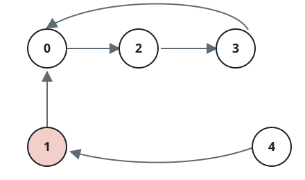
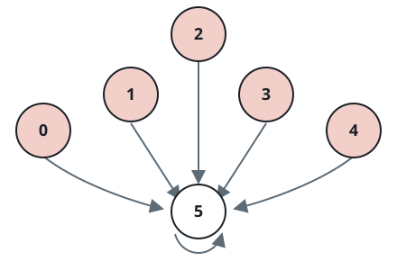
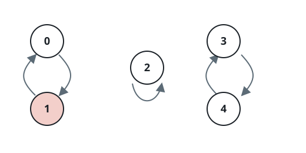

# Consistent-Direction Cycle

## Description

A circular array `nums` holds only non-zero integers. Starting at index `i`,
the value `nums[i]` tells you how far to jump: a positive value moves forward
that many positions, a negative value moves backward by its absolute value.
The array wraps around, so moving past the last index lands on the first, and
moving before the first lands on the last.

A cycle is a repeating sequence of indices that obeys three rules:

- following the jump rules keeps returning to the sequence's start,
- every jump along the cycle goes in the same direction (all forward or all
  backward), and
- the cycle contains at least two indices.

Return `true` if `nums` contains a cycle, and `false` otherwise.

### Example 1



```text
Input: nums = [2,-1,1,2,2]
Output: true
Explanation: The jumps trace the repeating sequence 0 -> 2 -> 3 -> 0, and
every hop is forward.
```

### Example 2



```text
Input: nums = [-1,-2,-3,-4,-5,6]
Output: false
Explanation: The only repeating sequence has length one.
```

### Example 3



```text
Input: nums = [1,-1,5,1,4]
Output: true
Explanation: The sequence 3 -> 4 -> 3 moves forward on every hop.
```

### Constraints

- `1 <= nums.length <= 5000`
- `-1000 <= nums[i] <= 1000`
- `nums[i] != 0`

## Hints

### Hint 1

Every index has exactly one successor, so walking from any start either
returns to the path or ends.

### Hint 2

Mark the indices each walk visits, and stop a hop when it flips direction or
would loop back to its own index.
