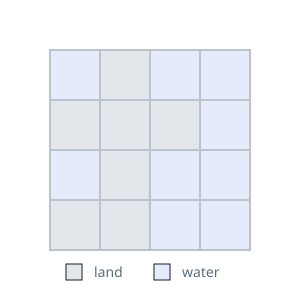

# Land Boundary Length

## Description

`grid` is a `row x col` map: `grid[i][j] == 1` marks land and `0` marks
water. Land cells connect orthogonally, never diagonally. The map is framed
by water, holds exactly one island, and the island contains no lakes — every
interior water cell borders the outside sea through other water cells.

Each cell is a unit square. Return the total length of the island's outline,
measuring every unit edge where land meets water.

### Example 1



```text
Input: grid = [[0,1,0,0],[1,1,1,0],[0,1,0,0],[1,1,0,0]]
Output: 16
Explanation: Sixteen unit edges separate the island from the water around it.
```

### Example 2

```text
Input: grid = [[1,1]]
Output: 6
Explanation: Two adjacent squares share one full edge, so the outline is
4 + 4 - 2 = 6 units.
```

### Example 3

```text
Input: grid = [[1,1,1]]
Output: 8
Explanation: The three squares in a row contribute 12 edges, and the two
shared borders hide four of them.
```

### Constraints

- `row == grid.length` and `col == grid[i].length`.
- `1 <= row, col <= 100`
- Each `grid[i][j]` is either `0` or `1`.
- `grid` contains exactly one island.
