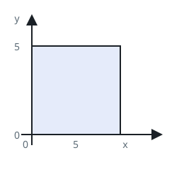
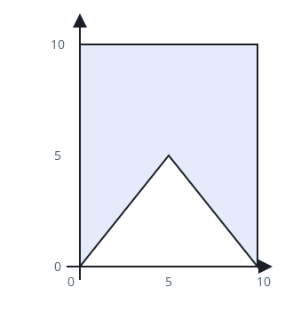

# Uniform-Turn Polygon

## Description

`points` lists the vertices of a polygon in the order they are joined,
`points[i] = [xi, yi]` on the X-Y plane. The polygon is simple: edges touch
only at consecutive vertices, where exactly two edges meet.

Return `true` when the polygon is convex — every turn along its boundary goes
the same direction — and `false` otherwise.

### Example 1



```text
Input: points = [[0,0],[0,5],[5,5],[5,0]]
Output: true
Explanation: The square turns the same way at each of its four corners.
```

### Example 2



```text
Input: points = [[0,0],[0,10],[10,10],[10,0],[5,5]]
Output: false
Explanation: The indented fifth vertex reverses the boundary's turning
direction.
```

### Example 3

```text
Input: points = [[0,0],[4,0],[0,3]]
Output: true
Explanation: A triangle is always convex.
```

### Constraints

- `3 <= points.length <= 10⁴`
- `points[i].length == 2`
- `-10⁴ <= xi, yi <= 10⁴`
- All points are distinct.
