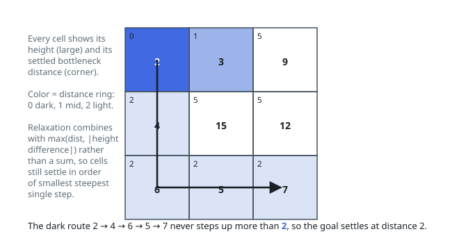

# Solutions — Flattest Route Across a Grid

Three ways to the same minimax answer: a binary search over candidate caps
each checked with a plain BFS, a Kruskal-style union-find whose answer is
the edge that first joins the two corners, and a bottleneck Dijkstra that
carries the running maximum.

## Binary Search on the Answer

Invert the question. Rather than hunting the flattest bottleneck directly,
test a cap: does some corner-to-corner route exist whose every step is at
most `cap` apart? Feasibility is monotone — a route under one cap stays under
any looser cap — so the workable caps fill a suffix `[answer, ∞)` whose left
edge binary search locates.

Each probe is a plain BFS from `(0, 0)` that crosses only edges whose height
difference is at most `mid`, marking cells so each is dequeued once. Reaching
the far corner accepts the cap and drops `hi` to `mid`; running out of cells
short of it rejects the cap and lifts `lo` past `mid`. The bounds open at
`[0, largest adjacent height difference]` — no route can be forced into a
bigger single step than that — and with a 1×1 grid there are no edges, so the
upper bound stays 0 and the loop never turns.

A probe is one linear sweep of the grid (`O(mn)` with the visited marking)
and about `log(max difference)` probes suffice, since the interval halves
each time. That log factor stands in for Dijkstra's `log(mn)` and is the
better trade whenever the height range is narrow relative to the grid.

**Complexity:** `O(mn log(max difference))` time — a linear BFS per
binary-search step — plus `O(mn)` space for the visited grid.

## Kruskal-Style Union-Find

List every grid edge — right-neighbor and down-neighbor of each cell, weighted
by the absolute height difference, endpoints flattened to `r * cols + c` —
and sort by weight ascending. That ordering is Kruskal's skeleton asked a
different stopping question: not "is the spanning tree finished" but "do the
two corners share a component yet".

Run a union-find (path compression, union by size) over the `m * n`
singletons and walk the edges lightest first, skipping pairs already tied
together and uniting the rest. The instant `find(0) == find(rows * cols - 1)`,
the current edge's weight is the answer: any route between the corners must
use some edge at least that heavy (every strictly lighter edge was already
offered and none of them closed the gap), while the edges consumed so far
describe a route whose heaviest step is at most that weight — the minimax
value. A 1×1 grid is born connected and answers 0 before any edge is read.

The sort carries the whole cost; the unions are nearly free.

**Complexity:** `O(E log E)` time for the sort, where `E = 2mn - m - n` grid
edges, plus near-inverse-Ackermann union-find operations; `O(mn)` space for
the edge list and the two arrays.

## Modified Dijkstra

A route's steepness is the largest step along it, not the sum of them, and
that makes the task a bottleneck shortest-path problem. Dijkstra still works —
swap addition for `max`. Reaching a neighbor now costs
`max(dist[current], |heights difference|)`, and the invariant survives: the
cell popped with the smallest tentative steepness already has its final
steepness, because `max` is monotone and never negative.

The heap starts at `(0, 0, 0)`. Each pop first asks whether it is the
bottom-right cell and returns on the spot, since the goal's first pop carries
its optimal value; a stale-record guard (`d > dist[r][c]`) discards outdated
entries, and each of the four neighbors is relaxed only when the new
bottleneck strictly improves its recorded value. A 1×1 grid returns 0 on the
opening pop, and downward steps never raise the running maximum.

Every relaxation only lowers a cell's tentative steepness and re-queues it at
most once per improving neighbor, so the loop finishes after `O(rows × cols)`
useful relaxations — textbook Dijkstra with the bottleneck rule in place of
addition.

**Complexity:** `O(mn log(mn))` time, `O(mn)` space, for an `m × n` grid.
