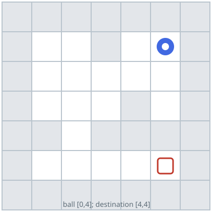
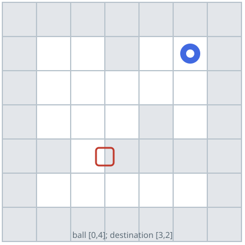

# Rolling-Ball Reachability

## Description

A ball rolls through a rectangular maze of open cells and walls. The maze is
given as an `m x n` grid `maze`, where `maze[r][c] == 0` marks an open cell
and `maze[r][c] == 1` marks a wall.

Once launched, the ball keeps rolling in a straight line — up, down, left, or
right — until it would leave the grid or enter a wall, and only then does it
come to rest and become free to choose a new direction. The border of the
maze behaves like a wall: a roll always stops at the last open cell before
it.

You are given the ball's starting cell `start = [startRow, startCol]` and a
destination cell `destination = [destinationRow, destinationCol]`. Return
`true` if the ball can come to rest exactly on the destination after some
sequence of rolls, and `false` otherwise.

The ball may pass over the destination mid-roll; that alone does not count.
It must be able to stop on it.

### Example 1



```text
Input: maze = [[0,0,1,0,0],[0,0,0,0,0],[0,0,0,1,0],[1,1,0,1,1],[0,0,0,0,0]], start = [0,4], destination = [4,4]
Output: true
Explanation: One possible route is left -> down -> left -> down -> right -> down -> right.
```

### Example 2



```text
Input: maze = [[0,0,1,0,0],[0,0,0,0,0],[0,0,0,1,0],[1,1,0,1,1],[0,0,0,0,0]], start = [0,4], destination = [3,2]
Output: false
Explanation: The ball passes through the destination cell but can never come
to rest on it, so the destination is not reachable.
```

### Example 3

```text
Input: maze = [[0,0,0],[1,1,0],[0,0,0]], start = [0,0], destination = [2,2]
Output: true
Explanation: Rolling right from the start stops at the right edge, and
rolling down from there drops the ball onto the bottom edge — the
destination.
```

### Example 4

```text
Input: maze = [[0,0,0],[0,0,0]], start = [0,0], destination = [0,1]
Output: false
Explanation: Rolling right from the start passes over `[0,1]` and stops at
`[0,2]`; rolling down stops at the bottom edge. The ball can never come to
rest on `[0,1]`.
```

### Constraints

- `m == maze.length`
- `n == maze[i].length`
- `1 <= m, n <= 100`
- `maze[i][j]` is `0` or `1`
- `start.length == 2`
- `destination.length == 2`
- `0 <= startRow, destinationRow < m`
- `0 <= startCol, destinationCol < n`
- The start and the destination both lie on open cells, and they are not the
  same cell.
- The maze contains at least two open cells.

## Hints

### Hint 1

The ball is only ever free to choose a direction while it is at rest, so the
cells that matter are the ones it can stop on.

### Hint 2

From a rest cell, each of the four rolls ends at exactly one cell — the last
open cell before a wall or the border. Those rolls are the edges of a graph
whose nodes are rest cells.
