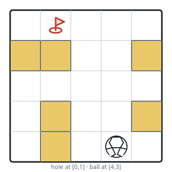
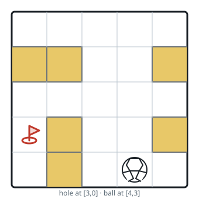

# Hole-Drop Shortest Path III

## Description

A ball rolls through a rectangular maze of open cells and walls, and the maze
contains a single hole. The maze is given as an `m x n` grid `maze`, where
`maze[r][c] == 0` marks an open cell and `maze[r][c] == 1` marks a wall.

Once launched, the ball keeps rolling in a straight line — up, down, left, or
right — until it would leave the grid, enter a wall, or roll onto the hole.
The border behaves like a wall, so a roll always stops at the last open cell
before it; but if the roll carries the ball onto the hole, the ball drops in
at once and the journey ends there, even when open cells lie beyond the hole.

You are given the ball's starting cell `ball = [ballRow, ballCol]` and the
hole's cell `hole = [holeRow, holeCol]`. Return the string of moves —
`'u'`, `'d'`, `'l'`, `'r'` for up, down, left, right — that drops the ball
into the hole after the fewest traveled cells, where the distance counts
every open cell the ball rolls through, excluding the start and including
the hole. If several move strings tie for the shortest distance, return the
lexicographically smallest one. If the ball can never reach the hole, return
`"impossible"`.

### Example 1



```text
Input: maze = [[0,0,0,0,0],[1,1,0,0,1],[0,0,0,0,0],[0,1,0,0,1],[0,1,0,0,0]], ball = [4,3], hole = [0,1]
Output: "lul"
Explanation: Two routes reach the hole in six traveled cells: left -> up ->
left, written `"lul"`, and up -> left, written `"ul"`. Both travel six
cells, and `"lul"` is lexicographically smaller because `'l' < 'u'`.
```

### Example 2



```text
Input: maze = [[0,0,0,0,0],[1,1,0,0,1],[0,0,0,0,0],[0,1,0,0,1],[0,1,0,0,0]], ball = [4,3], hole = [3,0]
Output: "impossible"
Explanation: The ball cannot drop into the hole from this start.
```

### Example 3

```text
Input: maze = [[0,0,0],[1,1,0],[0,0,0]], ball = [0,0], hole = [2,2]
Output: "rd"
Explanation: Rolling right from the start stops at the right edge (two
traveled cells), then rolling down drops the ball into the hole (two more).
```

### Example 4

```text
Input: maze = [[0,0,1,0],[0,0,0,0],[1,1,0,0],[0,0,0,0]], ball = [0,0], hole = [2,3]
Output: "drd"
Explanation: Rolling down, then right, then down drops the ball into the hole
after three traveled cells — the only shortest route.
```

### Constraints

- `m == maze.length`
- `n == maze[i].length`
- `1 <= m, n <= 100`
- `maze[i][j]` is `0` or `1`
- `ball.length == 2`
- `hole.length == 2`
- `0 <= ballRow, holeRow < m`
- `0 <= ballCol, holeCol < n`
- The ball and the hole both lie on open cells, and they are not the same
  cell.
- The maze contains at least two open cells.

## Hints

### Hint 1

The ball is only ever free to choose a direction while it is at rest, and a
roll's length varies from cell to cell — so the search needs edge weights.

### Hint 2

A roll that steps onto the hole ends there, mid-roll, instead of stopping at
the next wall.

### Hint 3

Among routes of equal distance, the lexicographically smallest move string
wins. Order the exploration by `(distance, move string)` so the first route
that reaches the hole is the answer.
