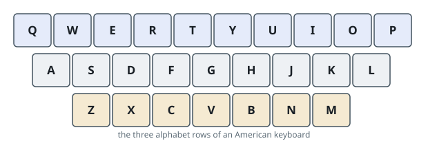

# Single-Row Typing

## Description

An American keyboard arranges its letters on three rows:

- the first row holds `"qwertyuiop"`,
- the second row holds `"asdfghjkl"`, and
- the third row holds `"zxcvbnm"`.

Matching is case-insensitive: the lowercase and uppercase forms of a letter
sit on the same physical key and therefore belong to the same row.



Given an array `words`, return the words that can be typed using letters from
only one row of the keyboard. The answer keeps the order in which the words
appear in `words`, and each returned word keeps its original casing.

### Example 1

```text
Input: words = ["qwe","asdfg","zxcv","qaz","bnm"]
Output: ["qwe","asdfg","zxcv","bnm"]
Explanation: `"qwe"` uses only row 1, `"asdfg"` only row 2, and `"zxcv"` and
`"bnm"` only row 3. `"qaz"` mixes all three rows and is dropped.
```

### Example 2

```text
Input: words = ["a","b","c"]
Output: ["a","b","c"]
Explanation: A single-letter word trivially stays on one row.
```

### Example 3

```text
Input: words = ["Alaska","omk","Dad","qwerty"]
Output: ["Alaska","Dad","qwerty"]
Explanation: `"Alaska"` is typed entirely on row 2 (`"A"` and `"a"` share the
key), `"Dad"` entirely on row 2 as well, and `"qwerty"` entirely on row 1.
`"omk"` mixes row 1 and row 2 and is dropped.
```

### Constraints

- `1 <= words.length <= 20`
- `1 <= words[i].length <= 100`
- `words[i]` consists of English letters (both lowercase and uppercase).

## Hints

### Hint 1

Build a table that maps every letter to its row once.

### Hint 2

A word qualifies iff no letter leaves the row its first letter already fixed.
