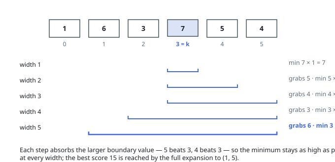

# Solutions — Best Min-Width Product Through K

## Two-Pointer Expansion from k

Every window through `k` is an interval `[lo, hi]` grown outward from the seed
`(k, k)`, so the decision space is just how far to reach left and right. A
window's product is its running minimum times its width: widening adds to the
width and can only hold the minimum steady or push it down, which makes every
intermediate interval on an expansion path a candidate in its own right.

Grow the window one element at a time, always absorbing the larger of the two
boundary values `nums[lo - 1]` and `nums[hi + 1]`, with forced moves once a
side runs out of array. The exchange argument: if the final window will
contain both boundary candidates anyway, the smaller of them eventually
lowers the running minimum no matter the order — so taking the larger first
keeps the minimum as high as possible at the current width, and at every width
until the smaller one joins. It follows that at each width `w` this rule
builds the length-`w` window through `k` with the greatest achievable minimum,
and scoring every step sweeps all widths.

In code, `cur_min` tracks the current interval's minimum and updates with each
absorbed element, while the best `cur_min * (hi - lo + 1)` is remembered; the
loop ends only when both pointers hit the array's ends, so widths 1 through
`n` are all visited. The seed cell contributes `nums[k] * 1`, which also
covers `n == 1`, where the loop body never runs.

**Complexity:** `O(n)` time, `O(1)` space.
