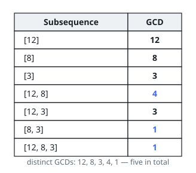

# Distinct Subsequence GCDs

## Description

You are given an array `nums` of positive integers.

A subsequence keeps some of the array's entries — at least one — in their
original order. The gcd of a subsequence is the largest integer that divides
every kept entry evenly; for instance the gcd of `[4, 6, 16]` is `2`.

Across all non-empty subsequences of `nums`, how many different gcd values
appear? Return that count.

### Example 1

```text
Input: nums = [12,8,3]
Output: 5
Explanation: The seven non-empty subsequences have gcds 12, 8, 3, 4, 3, 1 and
1. The five distinct values are 12, 8, 3, 4 and 1.
```



### Example 2

```text
Input: nums = [9,15]
Output: 3
Explanation: The subsequences [9], [15] and [9,15] have gcds 9, 15 and 3.
```

### Example 3

```text
Input: nums = [7,7]
Output: 1
Explanation: Every subsequence, pairing the sevens or taking either alone, has
gcd 7.
```

### Constraints

- `1 <= nums.length <= 10⁵`
- `1 <= nums[i] <= 2 * 10⁵`

## Hints

### Hint 1

Enumerating subsequences is a dead end; flip it around and test each candidate
value `g`: does some subsequence have gcd exactly `g`?

### Hint 2

Every entry of such a subsequence is a multiple of `g`, and dividing the
subsequence by `g` entrywise leaves a collection with gcd 1.

### Hint 3

Adding entries can never raise a gcd, so if any all-multiples-of-`g`
subsequence works, the subsequence keeping *every* multiple of `g` present in
the array works too.

### Hint 4

Try each `g` from 1 up to the largest value, walking the multiples of `g` that
are present.
