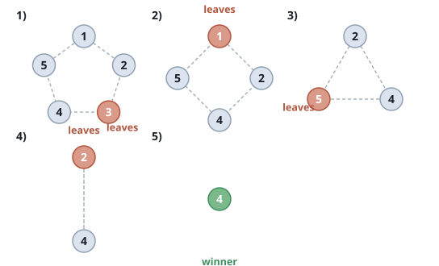

# Last One Standing In A Circle

## Description

`n` friends sit in a circle, numbered `1` through `n` clockwise. They play a
counting-out game:

- The first count begins at friend `1`.
- Each count takes in `k` friends in clockwise order, starting with the friend
  the count begins at. Counting may wrap around the circle and count a friend
  more than once.
- The `k`th friend counted steps out of the circle.
- While more than one friend remains, the next count begins at the friend
  immediately clockwise of the one who just left.
- The last friend left in the circle wins.

Given `n` and `k`, return the winner's number.

### Example 1

```text
Input: n = 5, k = 3
Output: 4
Explanation: The game plays out as follows:
1) Start at friend 1. Count 1, 2, 3 — friend 3 leaves.
2) Start at friend 4. Count 4, 5, 1 — friend 1 leaves.
3) Start at friend 2. Count 2, 4, 5 — friend 5 leaves.
4) Start at friend 2. Count 2, 4, 2 — the circle has wrapped — friend 2
   leaves.
Friend 4 is the only one left and wins.
```



### Example 2

```text
Input: n = 6, k = 4
Output: 5
Explanation: The friends leave in the order 4, 2, 1, 3, 6. Friend 5 is never
counted out.
```

### Example 3

```text
Input: n = 7, k = 2
Output: 7
Explanation: Every second friend goes: 2, 4, 6, then 1, 5 and 3, and friend 7
outlasts them all.
```

### Constraints

- `1 <= k <= n <= 500`

Follow up: can you find the winner in linear time with constant extra space?

## Hints

### Hint 1

With at most 500 friends, playing the game out — striking one friend per
round — is already fast enough.

### Hint 2

Keep the surviving friends in a list, in circle order, together with the
position where the next count begins.

### Hint 3

One count advances that position by `k − 1` places in the current list,
wrapping; the friend it lands on is the one who leaves, and the same position
then marks the start of the next count.
