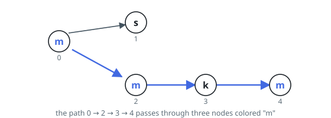
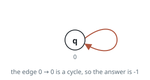

# Most Frequent Color on a Directed Path

## Description

A directed graph has `n` nodes numbered `0` to `n − 1` and `m` edges. You
are given a string `colors` whose `i`-th character is the lowercase letter
coloring node `i`, and a 2D array `edges` where `edges[j] = [u_j, v_j]`
marks a directed edge from `u_j` to `v_j`.

A **path** is a sequence of nodes `x1 → x2 → … → xk` in which every
consecutive pair is joined by a directed edge. Consider how often each
color occurs along a path, and take the color at the top of that count.

Return the largest such count over every path in the graph. If the graph
contains a cycle, return `-1` instead.

### Example 1

```text
Input: colors = "msmkm", edges = [[0,1],[0,2],[2,3],[3,4]]
Output: 3
Explanation: The path 0 → 2 → 3 → 4 visits three nodes colored "m".
```



### Example 2

```text
Input: colors = "q", edges = [[0,0]]
Output: -1
Explanation: The edge 0 → 0 loops back to its own start, so the graph has
a cycle.
```



### Example 3

```text
Input: colors = "tutt", edges = [[0,1],[0,2],[1,3],[2,3]]
Output: 3
Explanation: The graph is a diamond. The lower route 0 → 2 → 3 collects
the color "t" three times, one more than the upper route 0 → 1 → 3.
```

### Constraints

- `n == colors.length`
- `m == edges.length`
- `1 <= n <= 10⁵`
- `0 <= m <= 10⁵`
- `colors` consists of lowercase English letters.
- `0 <= u_j, v_j < n`

## Hints

### Hint 1

When there is no cycle, the nodes can be lined up so that every edge points
forward — process them in that order and each node's knowledge is complete
by the time it is reached.

### Hint 2

Keep, for each node, the best count of each of the 26 letters over all
paths ending there, and push each node's finished counts along its outgoing
edges.

### Hint 3

A cycle leaves some nodes forever unreachable in that forward order; if the
ordering visits fewer than `n` nodes, the answer is `-1`.
