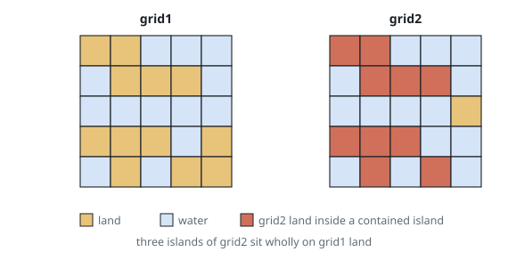
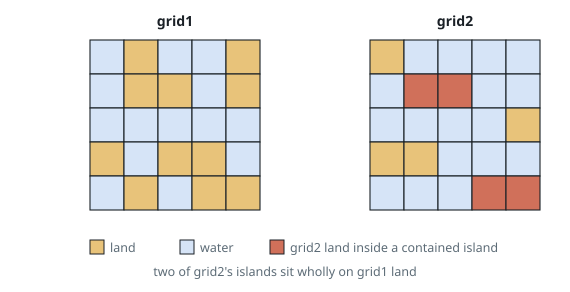

# Count Contained Grid Islands

## Description

Two same-sized binary matrices describe two maps of water and land:
`grid1` and `grid2` hold `0` for water and `1` for land. Land cells
joined edge to edge — horizontally or vertically — make up an island, and
everything beyond a grid's border behaves as water.

Call an island of `grid2` **contained** when a single island of `grid1`
covers every one of its cells, i.e. each cell of the `grid2` island is
also land in `grid1`.

Count the contained islands of `grid2` and return that number.

### Example 1

```text
Input: grid1 = [[1,1,0,0,0],[0,1,1,1,0],[0,0,0,0,0],[1,1,1,0,1],[0,1,0,1,1]], grid2 = [[1,1,0,0,0],[0,1,1,1,0],[0,0,0,0,1],[1,1,1,0,0],[0,1,0,1,0]]
Output: 3
Explanation: The five-cell island in the upper left, the four-cell island
at the lower left, and the single cell at (4,3) all sit on grid1 land. The
lone cell at (2,4) is water in grid1, so it does not count.
```



### Example 2

```text
Input: grid1 = [[0,1,0,0,1],[0,1,1,0,1],[0,0,0,0,0],[1,0,1,1,0],[0,1,0,1,1]], grid2 = [[1,0,0,0,0],[0,1,1,0,0],[0,0,0,0,1],[1,1,0,0,0],[0,0,0,1,1]]
Output: 2
Explanation: Only the island {(1,1),(1,2)} and the pair {(4,3),(4,4)}
lie wholly on grid1 land. The island at (0,0) sits on grid1 water, the
cell at (2,4) does too, and the pair {(3,0),(3,1)} includes (3,1), water
in grid1.
```



### Constraints

- The two grids share the same dimensions, `m x n`, with
  `1 <= m, n <= 500`.
- Every entry of both grids is `0` or `1`.

## Hints

### Hint 1

Walk the islands of `grid2` with a flood fill.

### Hint 2

A `grid2` island is contained exactly when each of its cells is land in
`grid1` — those cells are then connected in `grid1` as well, so one
`grid1` island covers them all.
