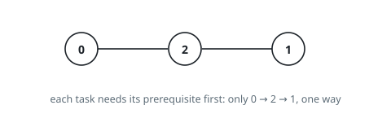
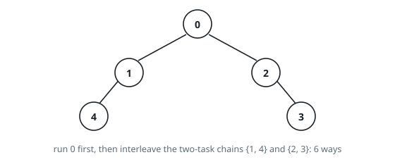

# Count Dependency Tree Orderings

## Description

A project has `n` tasks numbered `0` to `n - 1`, linked in a tree of
prerequisites. The 0-indexed array `parents` of length `n` describes it:
for each `i >= 1`, task `parents[i]` must be finished before task `i`
begins, and the two tasks are directly linked. Task `0` has no
prerequisite, so `parents[0] = -1`. The plan is complete in the sense
that, with every task finished, each task is reachable from task `0`
along the links.

One task runs at a time, and a task may start the moment its
prerequisite is finished.

Count the distinct orders in which all `n` tasks can be completed. The
count can be enormous, so report it **modulo** `10^9 + 7`.

### Example 1

```text
Input: parents = [-1,2,0]
Output: 1
Explanation: Task 0 must run first, task 2 needs task 0, and task 1 needs
task 2 — the single legal order is 0 → 2 → 1.
```



### Example 2

```text
Input: parents = [-1,0,0,2,1]
Output: 6
Explanation: Tasks 1 and 2 both depend only on 0; task 3 needs 2 and
task 4 needs 1. The six legal orders are:
0 → 1 → 4 → 2 → 3
0 → 2 → 3 → 1 → 4
0 → 1 → 2 → 4 → 3
0 → 1 → 2 → 3 → 4
0 → 2 → 1 → 3 → 4
0 → 2 → 1 → 4 → 3
```



### Constraints

- `n == parents.length`
- `2 <= n <= 10^5`
- `parents[0] == -1`
- `0 <= parents[i] < n` for all `1 <= i < n`
- Every task is reachable from task `0` through the links once all are
  finished.

## Hints

### Hint 1

Run dynamic programming over the tree rooted at task 0.

### Hint 2

Let `ways[v]` be the answer for the subtree hanging below task `v`.

### Hint 3

`ways[v]` is the number of ways to interleave the already-valid orderings
of the child subtrees — a multinomial coefficient — times the product of
the children's `ways` values.
