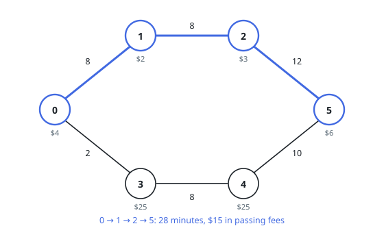
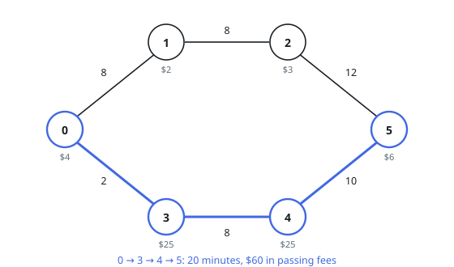

# Cheapest Route Within Time

## Description

A road network has `n` cities numbered `0` to `n - 1`. The 2D integer array
`edges` describes the roads: `edges[i] = [xi, yi, timei]` is a two-way road
between cities `xi` and `yi` that takes `timei` minutes to drive. Two cities
can be joined by several roads with different travel times, and no road
joins a city to itself.

Entering a city costs money: the 0-indexed array `passingFees`, of length
`n`, gives the fee for city `j` as `passingFees[j]`, and you pay it every
time you pass through — the start and the destination included.

You begin at city `0` and must reach city `n - 1` within `maxTime` minutes.
Return the smallest total fee of any such journey, or `-1` when the deadline
cannot be met.

### Example 1

```text
Input: maxTime = 28, edges = [[0,1,8],[1,2,8],[2,5,12],[0,3,2],[3,4,8],[4,5,10]],
       passingFees = [4,2,3,25,25,6]
Output: 15
Explanation: Driving 0 -> 1 -> 2 -> 5 uses all 28 minutes and pays
4 + 2 + 3 + 6 = 15.
```



### Example 2

```text
Input: maxTime = 27, edges = [[0,1,8],[1,2,8],[2,5,12],[0,3,2],[3,4,8],[4,5,10]],
       passingFees = [4,2,3,25,25,6]
Output: 60
Explanation: One minute less and the top route no longer fits. The only
option left is 0 -> 3 -> 4 -> 5, taking 20 minutes and paying
4 + 25 + 25 + 6 = 60.
```



### Example 3

```text
Input: maxTime = 100, edges = [[0,1,50],[1,2,50],[0,2,120],[0,2,80]],
       passingFees = [6,8,9]
Output: 15
Explanation: Two roads connect cities 0 and 2 directly. The 80-minute one
fits the budget and pays 6 + 9 = 15, beating the two-leg drive through
city 1 (100 minutes, fee 23). The 120-minute road is too slow.
```

### Constraints

- `1 <= maxTime <= 1000`
- `2 <= n == passingFees.length <= 1000`
- `n - 1 <= edges.length <= 1000`
- `0 <= xi, yi <= n - 1`
- `1 <= timei <= 1000`
- `1 <= passingFees[j] <= 1000`
- A pair of cities may be joined by multiple roads.
- No road joins a city to itself.

## Hints

### Hint 1

Two quantities compete: the cheapest route may be too slow, the quickest too
pricey. Enlarge the state so both are tracked — what if a node were "city
`c` at minute `t`"?

### Hint 2

In that time-layered graph you want the cheapest path, which is the same as
a dynamic program over exact arrival minutes.
