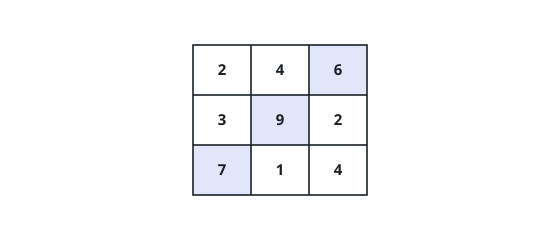
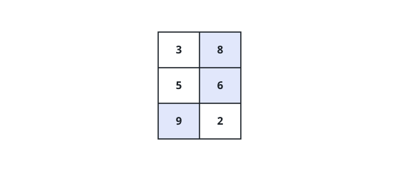

# Row Picks With Distance Penalty

## Description

You are given an `m x n` integer matrix `points`, and your score starts at
`0`.

Go through the matrix one row at a time and pick exactly one cell in every
row. Picking the cell at `(r, c)` earns `points[r][c]`.

There is a charge for drifting sideways: whenever the cells chosen in two
consecutive rows `r` and `r + 1` sit at columns `c1` and `c2`, the score
loses `abs(c1 - c2)`.

Return the highest score you can finish with. Here `abs(x)` is `x` when
`x >= 0` and `-x` otherwise.

### Example 1

```text
Input: points = [[2,4,6],
                 [3,9,2],
                 [7,1,4]]
Output: 20
Explanation: The tinted cells (0,2), (1,1), (2,0) earn 6 + 9 + 7 = 22,
and the sideways drift costs abs(2-1) + abs(1-0) = 2, leaving 20.
```



### Example 2

```text
Input: points = [[3,8],
                 [5,6],
                 [9,2]]
Output: 22
Explanation: Picking (0,1), (1,1), (2,0) earns 8 + 6 + 9 = 23 and pays
abs(1-1) + abs(1-0) = 1, for a final 22.
```



### Example 3

```text
Input: points = [[2,7,1,3],
                 [6,1,5,2]]
Output: 12
Explanation: Take 7 from the top row and 6 from the bottom (columns 1 and
0): 13 earned, 1 paid for the one-column shift.
```

### Constraints

- `1 <= m == points.length, n == points[r].length <= 10^5`
- `1 <= m * n <= 10^5`
- `0 <= points[r][c] <= 10^5`

## Hints

### Hint 1

Dynamic programming over rows: `dp[c]` = best score so far when the current
row's pick is in column `c`.

### Hint 2

The naive transition tries every previous column, costing `O(n²)` per row.
Split the absolute value by direction — each side then has a term depending
on the column alone, so a running maximum in each sweep replaces the rescan.
