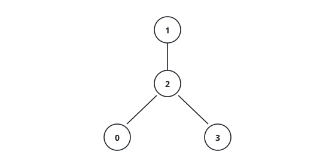
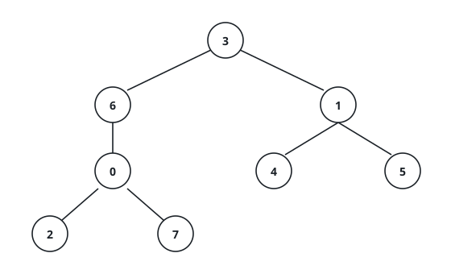

# Maximum Xor Along Root Paths

## Description

You are given a rooted tree of `n` nodes numbered `0` to `n - 1`, described by
the integer array `parents`: `parents[i]` is the parent of node `i`, and the
root is the one node `x` with `parents[x] == -1`. Each node carries a value
equal to its own number, so node `x` has value `x`.

You are also given `queries`, where `queries[i] = [nodei, vali]`. For each
query, consider every node `pi` on the chain from `nodei` up to the root —
both endpoints included — and report the largest `vali XOR pi`.

Return an array `ans` with one entry per query.

### Example 1

```text
Input: parents = [2,-1,1,1], queries = [[0,3],[3,3],[2,6]]
Output: [3,2,7]
Explanation: The root is node 1, its child is 2, and nodes 0 and 3 hang
from node 2.
- [0,3]: the chain holds 0, 2, 1; 3 XOR 0 = 3 beats the others.
- [3,3]: the chain holds 3, 2, 1; the best is 3 XOR 1 = 2.
- [2,6]: the chain holds 2, 1; 6 XOR 1 = 7.
```



### Example 2

```text
Input: parents = [6,3,0,-1,1,1,3,0], queries = [[2,9],[4,12],[0,7]]
Output: [15,15,7]
Explanation: The root is node 3 with children 1 and 6; node 1 has children
4 and 5; node 6 has child 0; node 0 has children 2 and 7.
- [2,9]: chain 2, 0, 6, 3; 9 XOR 6 = 15.
- [4,12]: chain 4, 1, 3; 12 XOR 3 = 15.
- [0,7]: chain 0, 6, 3; 7 XOR 0 = 7.
```



### Example 3

```text
Input: parents = [-1,0,1,2,3], queries = [[4,8],[0,7]]
Output: [12,7]
Explanation: The tree is the chain 0 - 1 - 2 - 3 - 4. From node 4 every
ancestor is available, and 8 XOR 4 = 12; from the root only 0 is, giving
7 XOR 0 = 7.
```

### Constraints

- `2 <= parents.length <= 10⁵`
- `0 <= parents[i] <= parents.length - 1` whenever `i` is not the root.
- Exactly one entry of `parents` is `-1` (the root's).
- `1 <= queries.length <= 3 * 10⁴`
- `0 <= nodei <= parents.length - 1`
- `0 <= vali <= 2 * 10⁵`

## Hints

### Hint 1

The set a query needs is exactly the root-to-node chain, so one traversal
that maintains "the current chain" can serve every query at its own node.

### Hint 2

Enter a node: add its value to a binary trie; leave it: remove the value
again. The trie then always holds precisely the current chain.

### Hint 3

To answer a query, descend the trie bit by bit from the top, each level
favoring the child whose bit opposes the query's.
