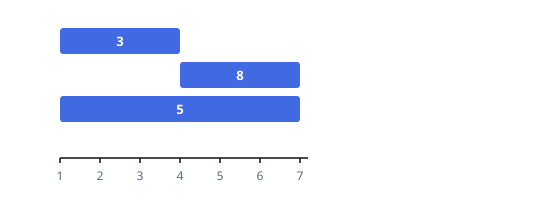
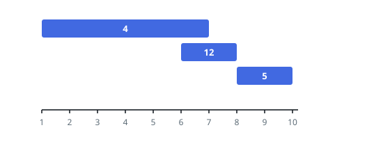
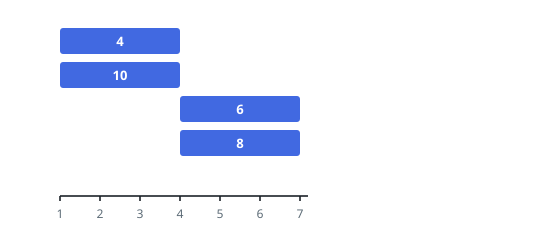

# Mixed Layer Sums

## Description

A long, thin canvas sits on a number line. It was painted in several passes:
the 2D integer array `segments` lists them, with
`segments[i] = [start_i, end_i, color_i]` meaning the half-closed stretch
`[start_i, end_i)` received `color_i`, and no two passes share a color.

Where stretches overlap, the colors sit on top of each other, and the stack
of colors is what the eye sees. Mixing colors `2`, `4`, and `6`, say,
produces `{2,4,6}`. To keep the answer compact you report only the total of
each stack, not the stack itself.

Describe the finished canvas using as few non-overlapping half-closed
stretches as possible, as a 2D array `painting` whose entry
`[left_j, right_j, mix_j]` names a stretch `[left_j, right_j)` and the total
`mix_j` of the colors stacked there. Untouched stretches of the line are
left out.

For instance, passes `[[2,5,4],[2,6,9]]` compress to `[[2,5,13],[5,6,9]]`:
both colors coat `[2,5)`, while only color `9` reaches `[5,6)`.

Return `painting`. Any order would describe the same canvas, but this judge
expects the rows sorted by left endpoint, ascending.

Here `[a, b)` means: point `a` included, point `b` excluded.

### Example 1

```text
Input: segments = [[1,4,3],[4,7,8],[1,7,5]]
Output: [[1,4,8],[4,7,13]]
Explanation:
- [1,4) carries colors {3,5}, totaling 8, from the first and third passes.
- [4,7) carries colors {8,5}, totaling 13, from the second and third passes.
```



### Example 2

```text
Input: segments = [[1,7,4],[6,8,12],[8,10,5]]
Output: [[1,6,4],[6,7,16],[7,8,12],[8,10,5]]
Explanation:
- [1,6) shows color 4 alone.
- [6,7) stacks {4,12}, totaling 16.
- [7,8) shows color 12 alone.
- [8,10) shows color 5 alone.
```



### Example 3

```text
Input: segments = [[1,4,4],[1,4,10],[4,7,6],[4,7,8]]
Output: [[1,4,14],[4,7,14]]
Explanation:
- [1,4) stacks {4,10}, totaling 14.
- [4,7) stacks {6,8}, also totaling 14.
Merging them into one [1,7) row would be wrong: the stacks differ even
though their totals agree.
```



### Constraints

- `1 <= segments.length <= 2 * 10^4`
- `segments[i].length == 3`
- `1 <= start_i < end_i <= 10^5`
- `1 <= color_i <= 10^9`
- No color appears in more than one segment.

## Hints

### Hint 1

The stack can only change where some pass begins or ends, so turn every
boundary into an event — a color added at its start, removed at its end —
and sort the events by position.

### Hint 2

Walk the line left to right carrying a running total of the colors
currently on the canvas.

### Hint 3

Cut a new output row at every event position, and step over the gaps where
the running total has fallen back to zero.
